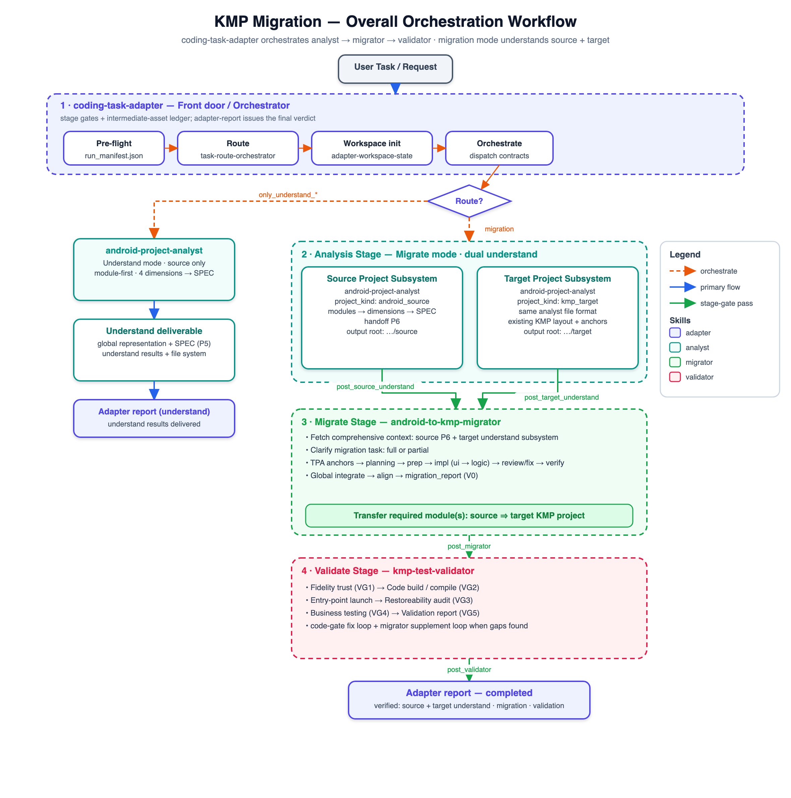

# KMP Migration Plugin

Specialized agents and Swarm Skills for migrating Android projects to Kotlin Multiplatform (KMP), orchestrated by a front-door task adapter.

Version: `0.1.30`

## Orchestration

The `coding-task-adapter` skill is the front door for every request. It classifies intent, then drives a staged pipeline with gates between each boundary:

- **Understand mode** (`only_understand_*`) — one `android-project-analyst` run on the source produces the understand results and file system, then stops.
- **Migrate mode** (`migration`) — the analysis stage understands **both** projects: `android-project-analyst` runs once on the source (Source Project Subsystem, `P6`) and once on the target (Target Project Subsystem, same file format) into two distinct understand roots. `android-to-kmp-migrator` then fetches both subsystems, clarifies full vs. partial scope, transfers the requested module from source into the target, and hands off to the mandatory `kmp-test-validator` before the adapter issues its final verdict.



## Agents

### `android-project-analyst`
Controller-only, module-first project analysis agent. It verifies the request, partitions the project into modules, and dispatches node subagents across four dimensions (presentation/resource, project-architecture, data-contract/flow, behavior-logic), then integrates verified outputs into per-module representations, cross-module assembly basis, and SPEC documentation (`PRD`, `DESIGN`, `PLAN` when migration mode applies, plus `verification.md`). In migration mode it runs as two understand subsystems — `android_source` and `kmp_target` — written to distinct output roots.

### `android-to-kmp-migrator`
Controller-only Android-to-KMP migration agent. It consumes both understand subsystems (source `P6` + target), clarifies full vs. partial scope, and dispatches workspace-state, target-project-assistant, planning-gate, prep, module-implementation (UI then logic), review/fix, verification, global integrate/align, and completion-report node subagents to edit the target KMP project, then invokes KMP validation after the migration report is ready.

### `kmp-test-validator`
Controller-only post-migration validation agent. It verifies migration context (`V0`), then dispatches workspace-state, fidelity gate (trust + restoreability), code gate (build + fix), entry-point launch, optional business testing, and reporting node subagents, then returns the final validation status.

### `memory-curator`
Audits and optimizes agent memory stores. Recommends which memories to retain, archive, or delete, and records resumable agent state for recovery.

### `skill-maintenance-advisor`
Reviews conversation context at regular turn intervals and recommends creating or updating reusable skills when useful patterns appear.

## Skill Map Architecture

The skills organize by invocation path, required inputs, controller/node skill flow, and output artifacts (see the orchestration diagram above, `assets/overall_migration.png`):

- `coding-task-adapter`: the front door; classifies the request, routes understand/migration/validation work, runs dual source+target understanding for migrations, enforces stage gates, and emits the final adapter report.
- `android-project-analyst`: invoked by the adapter (or directly via `/legacy-android-understand`); requires a project path and analysis scope; produces module representations, cross-module records, and SPEC artifacts. Migration mode produces a source subsystem and a target subsystem.
- `android-to-kmp-migrator`: invoked for Android-to-KMP migration; requires Android source, KMP target, both understand subsystems, migration scope, and validation requirements; produces changed KMP files and a migration report.
- `kmp-test-validator`: invoked after a migration report is ready or by an explicit migrated-behavior validation request; requires Android/SPEC evidence, KMP target, migration report, changed files, commands, and test cases; produces validation reports, fix evidence, and final status.

## Strict Sub-Agent Contracts

Every controller and node skill in this plugin treats input validation and output storage as mandatory gates. Sub-agents must read their skill spec, validate required inputs and upstream artifacts, resolve `output_dir`, write the exact required JSON/Markdown outputs under that directory, and return verified artifact paths in `output_files`. Missing, stale, contradictory, or out-of-scope inputs must stop the node with blockers or rerun requests; sub-agents must not guess, silently continue, or claim readiness without stored artifacts.

`android-project-analyst` uses a convert-mode skill contract: raw Legacy Android source plus optional Android Studio MCP context is converted into bounded node outputs, then into SPEC artifacts with traceable evidence for downstream migration, onboarding, and validation agents.

## Usage

After installation, the agents are available in your Claude Code environment. You can trigger them by name or by describing the task.

Default artifact roots:

- Understand/explore artifacts: `~/.a2c_agents/understand/`
- Migration artifacts: `~/.a2c_agents/migration/`
- Validation artifacts: `~/.a2c_agents/validation/`

SPEC documents are written under `<output_dir>/SPEC`.

### Explore Mode Prompt Template

Use `android-project-analyst` when you want structured understanding of an existing Android project before migration or refactoring.

```text
Use the android-project-analyst agent in exploration mode.

source_project_path: <absolute path to Android project>
analysis_scope: <whole project | module | feature | screen>
mode: exploration
output_dir: <optional artifact root; default ~/.a2c_agents/understand/>
language: English

Goal:
- Understand the Android project structure, UI, architecture, APIs, resources, data flow, and logic/control flow.
- Generate SPEC artifacts under <output_dir>/SPEC: prd.md, design.md, verification.md.
```

Example:

```text
Use android-project-analyst in exploration mode.

source_project_path: /Users/me/projects/legacy-android
analysis_scope: checkout feature
mode: exploration
output_dir: ~/.a2c_agents/understand/checkout
language: English

Please analyze the checkout feature and produce evidence-backed SPEC docs.
```

Natural-language example:

```text
Analyze this Android project with android-project-analyst in exploration mode:
/Users/me/projects/legacy-android

Focus on the checkout feature and write SPEC docs under ~/.a2c_agents/understand/checkout/SPEC.
```

### Legacy Android Understand Command

Use `/legacy-android-understand` as a slash-command entry point for `android-project-analyst` exploration mode. It accepts a whole project, module/feature/screen scope, a question to answer after analysis, or target code paths to trace.

```text
/legacy-android-understand

source_project_path: <absolute path to Legacy Android project>
analysis_scope: <whole project | module | feature | screen | target code>
question: <optional question to answer after analysis>
module: <optional Gradle module, package, or module name>
feature: <optional feature or user flow>
screen: <optional Activity, Fragment, or Compose screen>
target_code:
- <optional file/class/package path to analyze>
output_dir: <optional artifact root; default ~/.a2c_agents/understand/>
language: English
```

The command forces `mode: exploration`, dispatches `android-project-analyst`, writes `prd.md`, `design.md`, and `verification.md` under `<output_dir>/SPEC`, then returns the answer or scoped code understanding backed by generated evidence.

### Migration Mode Prompt Template

Use `android-to-kmp-migrator` when you want to migrate Android behavior into a KMP or Compose Multiplatform target. If Legacy Android SPEC artifacts are missing or incomplete, the migrator will invoke `android-project-analyst` in migration mode first.

```text
Use the android-to-kmp-migrator agent.

legacy_android_project_path: <absolute path to Android project>
kmp_target_project_path: <absolute path to KMP target project>
migration_scope: <whole project | module | feature | screen | task>
spec_dir: <optional path to existing SPEC directory>
output_dir: <optional artifact root; default ~/.a2c_agents/migration/>
validation_requirements: <optional build targets, use cases, preview expectations, acceptance criteria>
language: English

Goal:
- Migrate the requested Android behavior into the KMP target project.
- Preserve UI, resources, navigation, data flow, API contracts, state, and business logic.
- Produce a migration report under <output_dir> and invoke KMP validation when ready.
```

Example:

```text
Use android-to-kmp-migrator.

legacy_android_project_path: /Users/me/projects/legacy-android
kmp_target_project_path: /Users/me/projects/app-kmp
migration_scope: checkout feature
spec_dir: ~/.a2c_agents/understand/checkout/SPEC
output_dir: ~/.a2c_agents/migration/checkout
validation_requirements:
- Run the smallest available KMP build/check task.
- Verify checkout happy path, empty cart, payment error, and retry behavior.
- Check Compose renderability for migrated checkout screens.
language: English
```

Natural-language example:

```text
Migrate the checkout feature from /Users/me/projects/legacy-android into
/Users/me/projects/app-kmp using android-to-kmp-migrator.

Use existing SPEC from ~/.a2c_agents/understand/checkout/SPEC, write migration
artifacts to ~/.a2c_agents/migration/checkout, and validate build,
renderability, and checkout use cases after migration.
```

### Validation Prompt Template

Use `kmp-test-validator` when a migrated KMP target is ready to validate against Android source, SPEC, or a migration report.

```text
Use the kmp-test-validator agent.

kmp_target_project_path: <absolute path to migrated KMP project>
legacy_android_project_path: <absolute path to Android project>
migration_scope: <whole project | module | feature | screen | task>
spec_dir: <path to SPEC directory>
migration_report_path: <path to migration_report.md or migration_report.json>
output_dir: <optional artifact root; default ~/.a2c_agents/validation/>
validation_requirements: <build targets, use cases, preview expectations, acceptance criteria>
language: English
```

### Fix Issue Command

Use `/fix-issue-kmp` when a KMP/CMP target has a known compile failure or a migrated use-case failure that needs a focused fix plus rerun evidence.

```text
/fix-issue-kmp

kmp_target_project_path: <absolute path to KMP target project>
issue_type: <compile | use_case>
issue_summary: <known compiler, build, test, preview, or use-case failure>
failing_command: <optional exact command that currently fails>
failure_log_path: <optional path to full failure log>
legacy_android_project_path: <optional path when use-case behavior needs Android evidence>
spec_dir: <optional path to SPEC directory>
migration_report_path: <optional path to migration report>
allowed_files:
- <optional file path this fix may edit>
user_provided_commands:
  build: <optional build command>
  test: <optional use-case or regression command>
  renderability: <optional Compose preview/renderability command>
output_dir: optional artifact root; default ~/.a2c_agents/fix-issue-kmp/TIMESTAMP/
language: English
```

The command writes `fix_issue_kmp_report.md` and `fix_issue_kmp_report.json`, captures command logs, classifies failures, applies only targeted target-code fixes, and reruns the smallest failing command before broader build/check or use-case gates.

## Hooks and Guardrails

### `.env` Edit Protection

The plugin ships a `PreToolUse` command hook that blocks write/edit tools from modifying `.env` and `.env.*` files.

- Hook config: `hooks/hooks.json`
- Hook script: `scripts/pre-edit-protect.sh`
- Matched tools: `Write`, `Edit`, `MultiEdit`, and `NotebookEdit`
- Behavior: returns exit code `2` when the target path is a protected `.env` file.

### Ponytail Coding Guardrail

The plugin ships a Ponytail-style coding guardrail adapted from `DietrichGebert/ponytail`: before implementation, the agent must check whether the task can be skipped, solved by existing project code, solved by the standard library, solved by a native platform feature, solved by an installed dependency, or reduced to one line before writing new code.

- Skill: `skills/ponytail/SKILL.md`
- Review skill: `skills/ponytail-review/SKILL.md`
- Hook config: `hooks/hooks.json`
- Hook scripts: `hooks/ponytail-*.js`
- Validation script: `node scripts/check-ponytail-assets.js`

Lifecycle hooks activate Ponytail on `SessionStart`, propagate it on `SubagentStart`, and track `/ponytail lite|full|ultra|off` plus `/ponytail-review` from `UserPromptSubmit`. Set `PONYTAIL_DEFAULT_MODE=off` to disable the guardrail by default, or `lite`, `full`, or `ultra` to choose the startup level.

## Rule Contracts

The plugin includes agent-facing rules under `rules/`. These rules are contracts for controllers, stages, node skills, commands, fixes, and validation workflows:

- `stage-node-io-contract.mdc`: input checker first, durable output save before success, and exact handoff fields.
- `workflow-stage-contracts.mdc`: required gates for analyst, migrator, validator, and fix workflows.
- `agent-only-output-contract.mdc`: structured downstream-agent artifacts instead of human-oriented prose.
- `phase-document-template-contract.mdc`: documents plus their templates are mandatory across understanding, migration, and verification before a phase can claim success.
- `status-controller-task-ledger.mdc`: every running task is driven by a status controller whose task list tracks `todo`/`done`/`blocked` and gates stage advance.
- `fidelity-gate-verification.mdc`: an evidence-backed, fail-closed verification chain (migrator static checks → trust → build/launch → restoreability) keeps the fidelity gate high.
- `ponytail.mdc`: the Ponytail decision-ladder guardrail applied before writing new code.

Controllers reference these rules before dispatching or validating stage/node work.

## MCP Configuration

The plugin includes `.mcp.json` with a `jetbrains` MCP server entry for Android Studio and other JetBrains IDEs:

```json
{
  "mcpServers": {
    "jetbrains": {
      "type": "sse",
      "url": "http://localhost:64342/sse"
    }
  }
}
```

Before using it, enable Android Studio's MCP server from **Settings | Tools | MCP Server**. If your Android Studio MCP server uses a custom port, update the URL in `.mcp.json`.

Agent workflows use this MCP server opportunistically:

- Legacy and target understanding may use `get_project_modules`, `get_project_dependencies`, `get_repositories`, `find_files_by_glob`, `search_in_files_by_regex`, and `get_symbol_info` as indexed project-structure and code-intelligence context.
- Migration code-generation nodes record `get_file_problems` diagnostics for changed files when the server is available.
- Bug-fix and remediation nodes may use `get_file_problems`, `get_symbol_info`, `rename_refactoring`, and `reformat_file` for IDE-assisted fixes.
- After all target migration changes, and after build-fix passes, workflows may use `build_project` as an IDE diagnostic hook before required Gradle/build validation gates.
- Validation planning may use `get_run_configurations`, and scoped validation/fix flows may use `execute_run_configuration` when a discovered run config directly matches the task.

MCP diagnostics are advisory unless they identify concrete errors in changed files. Gradle build/check gates and `kmp-test-validator` remain authoritative.

## Skills

Each Swarm Skill has `SKILL.md` (team registry), `workflow.md` (staged dispatch topology and gates), `bind.md` (resource/behavioral constraints), `output-contract.md` (canonical paths and handoff gates), and `dependencies.yaml` (startup tools).

### `skills/coding-task-adapter`
The front-door **Swarm Skill** that classifies the task, routes understand/migration/validation work, runs the analysis stage as dual source+target understanding for migrations, enforces stage gates (`A0`–`A6`), and emits the final adapter report. Roles under `roles/`:

- `roles/task-route-orchestrator.md`: modes `route` (classify intent, paths, downstream sequence) and `orchestrate` (build analyst/migrator/validator dispatch contracts, record observed outputs).
- `roles/adapter-workspace-state.md`: stage inspections, intermediate-asset ledger, path/freshness compliance, and rerun routing.
- `roles/adapter-report.md`: final adapter verdict from verified route, orchestration, stage, and downstream evidence.

### `skills/android-project-analyst`
A module-first **Swarm Skill** (Mixed B+C pattern) used by the `android-project-analyst` controller. It partitions the project into modules, analyzes four dimensions per module, records cross-module assembly basis, and integrates a global representation + SPEC. Migration mode produces a source subsystem and a target subsystem (same file format, distinct output roots). Roles under `roles/`:

- `roles/analysis-workspace-state.md`: module/node/artifact ledger, todo list, pipeline monitor, handoff gates `P0`–`P6`, stale inputs, and rerun history.
- `roles/presentation-resource.md`: screens, UI technology, navigation, UI modules, local/remote resources, safe downloads, and UI/resource migration implications.
- `roles/project-architecture.md`: Gradle/module topology, architecture style, layer roles, dependency ecosystem, Jetpack/DI/platform services, and Android-only constraints.
- `roles/data-contract-flow.md`: network/local data contracts, models, repositories, streams, transformations, cache/error/pagination, write-back, and UI state propagation.
- `roles/behavior-logic.md`: user actions, lifecycle, state holders, business rules, side effects, state machines, navigation effects, and cross-module interactions.

### `skills/android-to-kmp-migrator`
A **Swarm Skill** (specialization pipeline C + parallel fan-outs B + review→fix loops) used by the `android-to-kmp-migrator` controller. It consumes both understand subsystems and edits the target KMP project under `kmp_target_project_path`, then hands off to the validator. Roles under `roles/`:

- `roles/migration-workspace-state.md`: todo list, pipeline monitor, handoff gates `M0`–`V0`, plan-vs-code gaps, stale outputs, and rerun hooks.
- `roles/target-project-assistant.md`: target KMP owner — global baseline, per-module anchors, and alignment revision, grounded in the Target Project Subsystem understand artifacts.
- `roles/migration-planning-gate.md`: planning + dependency/platform gate (SPEC deltas, source-to-target map, capability map, `ready_for_implementation`).
- `roles/migration-prep.md`: presentation + state/data prep (tokens, resources, routes, state/models/API and analytics expectations).
- `roles/module-implementation.md`: target KMP module implementation by mode — `ui` first, then `logic` (including analytics/埋点 restoration).
- `roles/module-node-review-fix.md`: review or scoped fix by mode, with a fresh re-review after every fix.
- `roles/migration-verification.md`: per-module static checks + UI/logic/analytics restoration vs analyst (no full project build).
- `roles/global-migration-phase.md`: global `integrate` (cross-module glue + entry-point + analytics SDK wiring) then read-only `align`.
- `roles/completion-report.md`: readiness and migration-report modes; mandatory validation handoff to `kmp-test-validator`.

`references/` holds the architecture references: `kmp-mvi-flowredux.md` (MVI, default), `kmp-mvvm.md` (MVVM), and `kmp-expert.md` (base KMP/CMP conventions).

### `skills/kmp-test-validator`
A **Swarm Skill** (5-role pipeline + fix/supplement loops) used by the `kmp-test-validator` controller. `output-contract.md` defines paths and `VG0`–`VG5` gates. Roles under `roles/`:

- `roles/validation-workspace-state.md`: ledger, handoff gates, fix/supplement cycle counts.
- `roles/validation-fidelity-gate.md`: modes `trust` (pre-build fidelity) and `restoreability` (post-build audit, migrator supplement routing).
- `roles/validation-code-gate.md`: modes `build` (three-scenario compile/preview) and `fix` (knowledge/error-DB/model, restoreability-preserving).
- `roles/validation-business-testing.md`: mandatory `entry_point_launch` plus optional `behavioral` and `ui_comparison` submodules when the user supplies test cases or Figma refs.
- `roles/validation-report.md`: final evidence-backed validation verdict.

### `skills/operating-instructions`
Shared baseline conduct layer (`SKILL.md`) included as `skills: [operating-instructions]` in every dispatched role across the adapter, analyst, migrator, and validator skills.

### `skills/ponytail` and `skills/ponytail-review`
The Ponytail coding guardrail and its review counterpart — a decision ladder that checks whether work can be skipped, reused, or reduced before writing new code. See [Ponytail Coding Guardrail](#ponytail-coding-guardrail).

## Structure

- `agents/`: Subagent definitions.
- `commands/`: Slash commands, including `/legacy-android-understand` for Android exploration and `/fix-issue-kmp` for targeted KMP compile or migrated use-case fixes.
- `skills/`: Swarm Skills and controller node skill specs (adapter, analyst, migrator, validator, operating-instructions, ponytail, ponytail-review).
- `rules/`: Agent-facing stage/node contracts for input validation, output saving, workflow gates, and agent-only artifacts.
- `hooks/`: Tool-layer enforcement — `.env` edit protection plus Ponytail lifecycle hooks.
- `scripts/`: Hook and utility scripts (`pre-edit-protect.sh`, `ktlint-format.sh`, `check-ponytail-assets.js`).
- `assets/`: Workflow diagrams (`overall_migration.png`/`.svg`, `wf_migration.png`).
- `monitors/`: Plugin monitor configuration.
- `output-styles/`: Output styles (`terse`).
- `themes/`: Editor/agent themes (`dracula`).
- `templates/`: Reserved for future migration templates.
- `.mcp.json`: Plugin MCP configuration, including the Android Studio/JetBrains MCP server.
- `.lsp.json`: Plugin LSP configuration.
- `settings.json`: Plugin settings.
