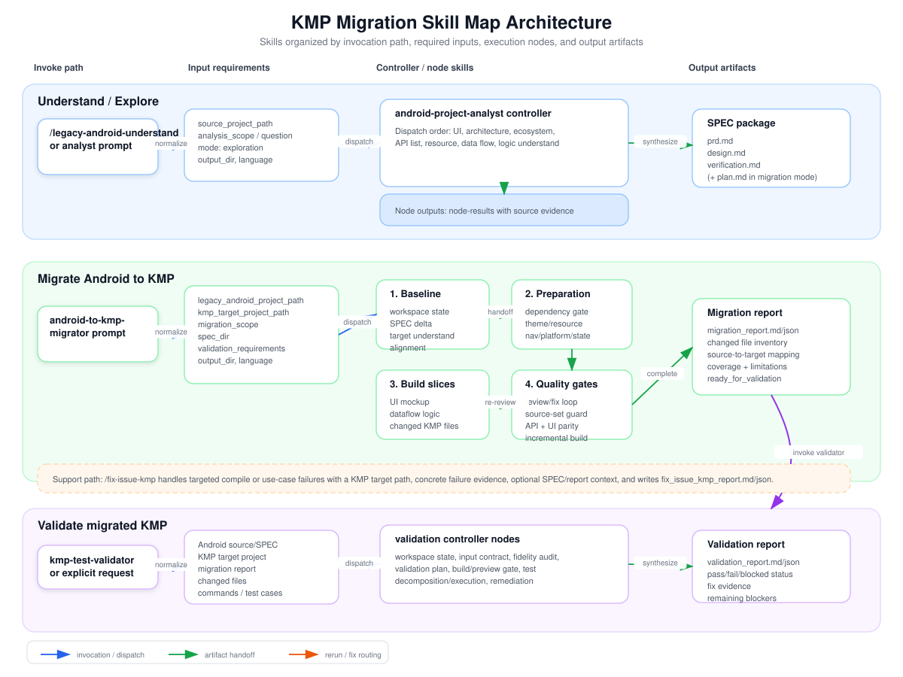

# KMP Migration Plugin

Specialized agents for migrating Android projects to Kotlin Multiplatform (KMP).

Version: `0.1.21`

## Agents

### `android-project-analyst`
Controller-only Android project analysis agent. It verifies the request, dispatches node subagents for UI, architecture, ecosystem, API, resource, data-flow, and logic understanding, then integrates verified outputs into SPEC documentation (`PRD`, `DESIGN`, `PLAN` when migration mode applies, plus `verification.md`).

### `android-to-kmp-migrator`
Controller-only Android-to-KMP migration agent. It verifies that the request is a migration scenario, requires Legacy Android SPEC context, dispatches workspace-state, SPEC-delta, target-understanding, resource/theme/navigation/platform/state, UI, dataflow/logic, module/node review-fix, guard/parity/fidelity/build-check, completion-check, and migration-report node subagents, and invokes KMP validation after the migration report is ready.

### `kmp-test-validator`
Controller-only post-migration validation agent. It verifies migration context, dispatches validation input, Android/KMP fidelity audit, validation planning, build/preview, test decomposition/execution, remediation, workspace-state, and reporting node subagents, then returns the final validation status.

### `memory-curator`
Audits and optimizes agent memory stores. Recommends which memories to retain, archive, or delete, and records resumable agent state for recovery.

### `skill-maintenance-advisor`
Reviews conversation context at regular turn intervals and recommends creating or updating reusable skills when useful patterns appear.

## Skill Map Architecture

The diagram below organizes the skills in this plugin by invocation path, required inputs, controller/node skill flow, and output artifacts.



- `android-project-analyst`: invoked directly or through `/legacy-android-understand`; requires a legacy Android project path and analysis scope; produces SPEC artifacts and node evidence.
- `android-to-kmp-migrator`: invoked for Android-to-KMP migration; requires Android source, KMP target, migration scope, optional SPEC, and validation requirements; produces changed KMP files and a migration report.
- `kmp-test-validator`: invoked after a migration report is ready or by an explicit migrated-behavior validation request; requires Android/SPEC evidence, KMP target, migration report, changed files, commands, and test cases; produces validation reports, fix evidence, and final status.

## Strict Sub-Agent Contracts

Every controller and node skill in this plugin treats input validation and output storage as mandatory gates. Sub-agents must read their skill spec, validate required inputs and upstream artifacts, resolve `output_dir`, write the exact required JSON/Markdown outputs under that directory, and return verified artifact paths in `output_files`. Missing, stale, contradictory, or out-of-scope inputs must stop the node with blockers or rerun requests; sub-agents must not guess, silently continue, or claim readiness without stored artifacts.

`android-project-analyst` uses a convert-mode skill contract: raw Legacy Android source plus optional Android Studio MCP context is converted into bounded node outputs, then into SPEC artifacts with traceable evidence for downstream migration, onboarding, and validation agents.

## Usage

After installation, the agents are available in your Claude Code environment. You can trigger them by name or by describing the task.

Default artifact roots:

- Understand/explore artifacts: `~/.a2c_agents/understand/`
- Migration artifacts: `~/.a2c_agents/migration/`
- Validation artifacts: `~/.a2c_agents/validation/`

SPEC documents are written under `<output_dir>/SPEC`.

### Explore Mode Prompt Template

Use `android-project-analyst` when you want structured understanding of an existing Android project before migration or refactoring.

```text
Use the android-project-analyst agent in exploration mode.

source_project_path: <absolute path to Android project>
analysis_scope: <whole project | module | feature | screen>
mode: exploration
output_dir: <optional artifact root; default ~/.a2c_agents/understand/>
language: English

Goal:
- Understand the Android project structure, UI, architecture, APIs, resources, data flow, and logic/control flow.
- Generate SPEC artifacts under <output_dir>/SPEC: prd.md, design.md, verification.md.
```

Example:

```text
Use android-project-analyst in exploration mode.

source_project_path: /Users/me/projects/legacy-android
analysis_scope: checkout feature
mode: exploration
output_dir: ~/.a2c_agents/understand/checkout
language: English

Please analyze the checkout feature and produce evidence-backed SPEC docs.
```

Natural-language example:

```text
Analyze this Android project with android-project-analyst in exploration mode:
/Users/me/projects/legacy-android

Focus on the checkout feature and write SPEC docs under ~/.a2c_agents/understand/checkout/SPEC.
```

### Legacy Android Understand Command

Use `/legacy-android-understand` as a slash-command entry point for `android-project-analyst` exploration mode. It accepts a whole project, module/feature/screen scope, a question to answer after analysis, or target code paths to trace.

```text
/legacy-android-understand

source_project_path: <absolute path to Legacy Android project>
analysis_scope: <whole project | module | feature | screen | target code>
question: <optional question to answer after analysis>
module: <optional Gradle module, package, or module name>
feature: <optional feature or user flow>
screen: <optional Activity, Fragment, or Compose screen>
target_code:
- <optional file/class/package path to analyze>
output_dir: <optional artifact root; default ~/.a2c_agents/understand/>
language: English
```

The command forces `mode: exploration`, dispatches `android-project-analyst`, writes `prd.md`, `design.md`, and `verification.md` under `<output_dir>/SPEC`, then returns the answer or scoped code understanding backed by generated evidence.

### Migration Mode Prompt Template

Use `android-to-kmp-migrator` when you want to migrate Android behavior into a KMP or Compose Multiplatform target. If Legacy Android SPEC artifacts are missing or incomplete, the migrator will invoke `android-project-analyst` in migration mode first.

```text
Use the android-to-kmp-migrator agent.

legacy_android_project_path: <absolute path to Android project>
kmp_target_project_path: <absolute path to KMP target project>
migration_scope: <whole project | module | feature | screen | task>
spec_dir: <optional path to existing SPEC directory>
output_dir: <optional artifact root; default ~/.a2c_agents/migration/>
validation_requirements: <optional build targets, use cases, preview expectations, acceptance criteria>
language: English

Goal:
- Migrate the requested Android behavior into the KMP target project.
- Preserve UI, resources, navigation, data flow, API contracts, state, and business logic.
- Produce a migration report under <output_dir> and invoke KMP validation when ready.
```

Example:

```text
Use android-to-kmp-migrator.

legacy_android_project_path: /Users/me/projects/legacy-android
kmp_target_project_path: /Users/me/projects/app-kmp
migration_scope: checkout feature
spec_dir: ~/.a2c_agents/understand/checkout/SPEC
output_dir: ~/.a2c_agents/migration/checkout
validation_requirements:
- Run the smallest available KMP build/check task.
- Verify checkout happy path, empty cart, payment error, and retry behavior.
- Check Compose renderability for migrated checkout screens.
language: English
```

Natural-language example:

```text
Migrate the checkout feature from /Users/me/projects/legacy-android into
/Users/me/projects/app-kmp using android-to-kmp-migrator.

Use existing SPEC from ~/.a2c_agents/understand/checkout/SPEC, write migration
artifacts to ~/.a2c_agents/migration/checkout, and validate build,
renderability, and checkout use cases after migration.
```

### Validation Prompt Template

Use `kmp-test-validator` when a migrated KMP target is ready to validate against Android source, SPEC, or a migration report.

```text
Use the kmp-test-validator agent.

kmp_target_project_path: <absolute path to migrated KMP project>
legacy_android_project_path: <absolute path to Android project>
migration_scope: <whole project | module | feature | screen | task>
spec_dir: <path to SPEC directory>
migration_report_path: <path to migration_report.md or migration_report.json>
output_dir: <optional artifact root; default ~/.a2c_agents/validation/>
validation_requirements: <build targets, use cases, preview expectations, acceptance criteria>
language: English
```

### Fix Issue Command

Use `/fix-issue-kmp` when a KMP/CMP target has a known compile failure or a migrated use-case failure that needs a focused fix plus rerun evidence.

```text
/fix-issue-kmp

kmp_target_project_path: <absolute path to KMP target project>
issue_type: <compile | use_case>
issue_summary: <known compiler, build, test, preview, or use-case failure>
failing_command: <optional exact command that currently fails>
failure_log_path: <optional path to full failure log>
legacy_android_project_path: <optional path when use-case behavior needs Android evidence>
spec_dir: <optional path to SPEC directory>
migration_report_path: <optional path to migration report>
allowed_files:
- <optional file path this fix may edit>
user_provided_commands:
  build: <optional build command>
  test: <optional use-case or regression command>
  renderability: <optional Compose preview/renderability command>
output_dir: optional artifact root; default ~/.a2c_agents/fix-issue-kmp/TIMESTAMP/
language: English
```

The command writes `fix_issue_kmp_report.md` and `fix_issue_kmp_report.json`, captures command logs, classifies failures, applies only targeted target-code fixes, and reruns the smallest failing command before broader build/check or use-case gates.

## Hooks and Guardrails

### `.env` Edit Protection

The plugin ships a `PreToolUse` command hook that blocks write/edit tools from modifying `.env` and `.env.*` files.

- Hook config: `hooks/hooks.json`
- Hook script: `scripts/pre-edit-protect.sh`
- Matched tools: `Write`, `Edit`, `MultiEdit`, and `NotebookEdit`
- Behavior: returns exit code `2` when the target path is a protected `.env` file.

### Ponytail Coding Guardrail

The plugin ships a Ponytail-style coding guardrail adapted from `DietrichGebert/ponytail`: before implementation, the agent must check whether the task can be skipped, solved by existing project code, solved by the standard library, solved by a native platform feature, solved by an installed dependency, or reduced to one line before writing new code.

- Skill: `skills/ponytail/SKILL.md`
- Review skill: `skills/ponytail-review/SKILL.md`
- Hook config: `hooks/hooks.json`
- Hook scripts: `hooks/ponytail-*.js`
- Validation script: `node scripts/check-ponytail-assets.js`

Lifecycle hooks activate Ponytail on `SessionStart`, propagate it on `SubagentStart`, and track `/ponytail lite|full|ultra|off` plus `/ponytail-review` from `UserPromptSubmit`. Set `PONYTAIL_DEFAULT_MODE=off` to disable the guardrail by default, or `lite`, `full`, or `ultra` to choose the startup level.

## Rule Contracts

The plugin includes agent-facing rules under `rules/`. These rules are contracts for controllers, stages, node skills, commands, fixes, and validation workflows:

- `stage-node-io-contract.md`: input checker first, durable output save before success, and exact handoff fields.
- `workflow-stage-contracts.md`: required gates for analyst, migrator, validator, and fix workflows.
- `agent-only-output-contract.md`: structured downstream-agent artifacts instead of human-oriented prose.
- `phase-document-template-contract.mdc`: documents plus their templates are mandatory across understanding, migration, and verification before a phase can claim success.
- `status-controller-task-ledger.mdc`: every running task is driven by a status controller whose task list tracks `todo`/`done`/`blocked` and gates stage advance.
- `fidelity-gate-verification.mdc`: an evidence-backed, fail-closed verification chain (migrator static checks → trust → build/launch → restoreability) keeps the fidelity gate high.

Controllers reference these rules before dispatching or validating stage/node work.

## MCP Configuration

The plugin includes `.mcp.json` with a `jetbrains` MCP server entry for Android Studio and other JetBrains IDEs:

```json
{
  "mcpServers": {
    "jetbrains": {
      "type": "sse",
      "url": "http://localhost:64342/sse"
    }
  }
}
```

Before using it, enable Android Studio's MCP server from **Settings | Tools | MCP Server**. If your Android Studio MCP server uses a custom port, update the URL in `.mcp.json`.

Agent workflows use this MCP server opportunistically:

- Legacy and target understanding may use `get_project_modules`, `get_project_dependencies`, `get_repositories`, `find_files_by_glob`, `search_in_files_by_regex`, and `get_symbol_info` as indexed project-structure and code-intelligence context.
- Migration code-generation nodes record `get_file_problems` diagnostics for changed files when the server is available.
- Bug-fix and remediation nodes may use `get_file_problems`, `get_symbol_info`, `rename_refactoring`, and `reformat_file` for IDE-assisted fixes.
- After all target migration changes, and after build-fix passes, workflows may use `build_project` as an IDE diagnostic hook before required Gradle/build validation gates.
- Validation planning may use `get_run_configurations`, and scoped validation/fix flows may use `execute_run_configuration` when a discovered run config directly matches the task.

MCP diagnostics are advisory unless they identify concrete errors in changed files. Gradle build/check gates and `kmp-test-validator` remain authoritative.

## Skills

### `skills/android-project-analyst`
A **Swarm Skill** (Mixed B+C pattern) used by the `android-project-analyst` controller. `SKILL.md` is the team registry; `workflow.md` holds the staged dispatch topology and gates; `bind.md` holds resource/behavioral constraints; `dependencies.yaml` lists startup tools. The seven node roles live under `roles/`:

- `roles/ui-understand.md`: owns UI entry points, screen inventory, UI technology, hierarchy, navigation, shared UI components, and UI module boundaries.
- `roles/architecture-pattern.md`: owns topology, architecture style, layer roles, dependency direction, boundary violations, and legacy hybrid risks.
- `roles/android-ecosystem.md`: owns Gradle/SDK/build configuration, Jetpack and third-party dependencies, DI, persistence, background work, platform services, generated tooling, and Android-only constraints.
- `roles/api-list.md`: owns network stack, API declarations, request/response models, consumers, local data sources, cache/error/pagination behavior, and unknown API gaps.
- `roles/resource-understand.md`: owns local resources, online image/icon/media sources, safe downloaded analysis copies, usage mapping, placeholders, production classification, and migration implications.
- `roles/data-flow.md`: owns data movement through repositories, data sources, mappers, reactive streams, caches, write-back paths, and UI state propagation.
- `roles/logic-understand.md`: owns user-action flows, lifecycle flows, state-holder behavior, business rules, side effects, state machines, navigation effects, and cross-module control interactions.

### `skills/android-to-kmp-migrator`
A **Swarm Skill** (specialization pipeline C + parallel fan-outs B + review→fix loops) used by the `android-to-kmp-migrator` controller. `SKILL.md` is the team registry; `workflow.md` holds the staged dispatch topology, gates, and failure routing; `bind.md` holds resource/behavioral constraints (dependency gate, single-project invariant, `max_review_fix_cycles`); `dependencies.yaml` lists startup tools. The twenty node roles live under `roles/`:

- `roles/target-project-understand.md`: relevant target sub-module detection plus current UI design, architecture, logic flow, API list, and reuse context.
- `roles/legacy-spec-delta-review.md`: SPEC/raw-source coverage check with contradiction and blocker routing.
- `roles/migration-alignment.md`: Legacy Android SPEC/raw understanding alignment with target project context and resource mapping.
- `roles/dependency-resolution.md`: minimal-change dependency gate, baseline capability mapping, and justified build-config exceptions.
- `roles/theme-design-system-mapping.md`: visual token and design-system mapping before UI implementation.
- `roles/resource-migration.md`: local and online resource migration into KMP target conventions.
- `roles/navigation-migration.md`: route, parameter, back behavior, deep link, and navigation scaffolding migration.
- `roles/platform-api-replacement.md`: Android-only API replacement through target-safe abstractions or expect/actual.
- `roles/state-model-mapping.md`: state holder and model mapping before dataflow/logic implementation.
- `roles/ui-mockup-implementation.md`: UI layout, component, theme/resource, and binding surface implementation.
- `roles/dataflow-logic-implementation.md`: architecture, data flow, API integration, navigation effects, lifecycle behavior, and business logic implementation.
- `roles/module-node-migration-review.md`: per-module or per-node review for contract compliance, source parity, target conventions, scope, and handoff readiness.
- `roles/module-node-migration-fix.md`: focused fixes from module/node review findings, followed by mandatory re-review.
- `roles/migration-workspace-state.md`: node status, changed-file ownership, stale output, rerun history, and blocker ledger.
- `roles/source-set-placement-guard.md`: KMP source-set placement and Android-only API boundary checks.
- `roles/api-contract-parity.md`: migrated API contract comparison against Legacy Android API/data evidence.
- `roles/ui-render-fidelity-check.md`: render path, visual-state, resource, and theme usage checks before final validation.
- `roles/incremental-build-check.md`: smallest known target build/check gate with failure routing.
- `roles/prd-completion-check.md`: PRD/raw task completion verification and re-dispatch gap reporting.
- `roles/migration-report.md`: final migration report with mappings, changed files, coverage, limitations, manual steps, and validation inputs.

### `skills/kmp-test-validator`
A **Swarm Skill** (5-role reduced pipeline + fix/supplement loops) used by the `kmp-test-validator` controller. `output-contract.md` defines paths and `VG0`–`VG5` gates; `ROLE_REDUCTION.md` documents the 7→5 merge. Active roles under `roles/`:

- `roles/validation-workspace-state.md`: ledger, handoff gates, fix/supplement cycle counts.
- `roles/validation-fidelity-gate.md`: modes `trust` (pre-build fidelity) and `restoreability` (post-build audit, migrator supplement routing).
- `roles/validation-code-gate.md`: modes `build` (three-scenario compile/preview) and `fix` (error DB or model, restoreability-preserving).
- `roles/validation-business-testing.md`: optional `behavioral` and `ui_comparison` submodules when user supplies test cases or Figma refs.
- `roles/validation-report.md`: final evidence-backed validation verdict.

## Structure

- `agents/`: Subagent definitions.
- `commands/`: Slash commands, including `/legacy-android-understand` for Android exploration and `/fix-issue-kmp` for targeted KMP compile or migrated use-case fixes.
- `skills/`: Claude Code skills and controller node skill specs.
- `rules/`: Agent-facing stage/node contracts for input validation, output saving, workflow gates, and agent-only artifacts.
- `hooks/`: Tool-layer enforcement, including a `PreToolUse` guard that blocks edits to `.env` files.
- `scripts/`: Hook and utility scripts, including `pre-edit-protect.sh`.
- `monitors/`: Plugin monitor configuration.
- `templates/`: Reserved for future migration templates.
- `.mcp.json`: Plugin MCP configuration, including the Android Studio/JetBrains MCP server.
- `.lsp.json`: Plugin LSP configuration.
- `settings.json`: Plugin settings.
