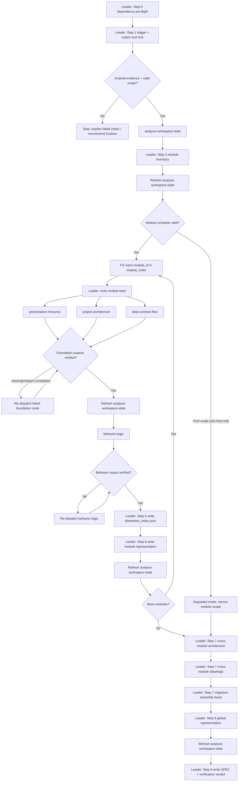

# Workflow: Legacy Android source → module artifacts → global representation → SPEC package

This Swarm Skill is **module-first Mixed B+C with workspace-state tracking**: the Leader first partitions the Legacy Android project into bounded analysis modules, maintains a ledger of module/node artifacts and stale inputs, then runs the foundation node schedule inside each module before combining the verified module representations into one global project representation and SPEC package. Each node owns a bounded module slice; the Leader never does node work and never invents claims that no node traced to source.

**File recording system**: every output path, content requirement, and downstream trigger gate is defined in [output-contract.md](output-contract.md). Downstream handlers (`migration-task-adapter`, `android-to-kmp-migrator`) MUST fail closed when handoff package artifacts are missing, empty, out-of-path, stale, or schema-invalid.

## Overview



## Strict Output Paths

The canonical path tree, filename invariants, and handoff packages `P0`–`P6` are in [output-contract.md](output-contract.md). This section summarizes path variables only.

The Leader MUST lock one `output_root` before dispatch and MUST reject or rerun any node that writes outside its assigned directory. Defaults:

- `output_root`: `<output_dir or ~/.a2c_agents/understand>/android-project-analyst`
- `workspace_state_dir`: `<output_root>/workspace-state`
- `module_index_dir`: `<output_root>/module-index`
- `module_root`: `<output_root>/modules/<module_id>`
- `module_node_dir`: `<module_root>/node-results/<node_id>`
- `module_representation_dir`: `<module_root>/representation`
- `global_dir`: `<output_root>/global`
- `spec_dir`: `<output_root>/SPEC`

Required durable artifacts:

| Schedule point | Required artifacts |
|---|---|
| Output root lock | `<output_root>/run_manifest.json` - run identity, paths, mode, scope, allowed roots, dependency status, schedule version |
| Workspace state | `<workspace_state_dir>/analysis_workspace_state.json`, `<workspace_state_dir>/analysis_workspace_state.md` - module/node/artifact ledger, stale inputs, reruns, blockers, next safe actions |
| Module inventory | `<module_index_dir>/module_inventory.json`, `<module_index_dir>/module_inventory.md` - deterministic module list/order, scopes, dependencies, out-of-scope roots, evidence |
| Modules index | `<module_index_dir>/modules_index.json` - machine-routable `module_id` → folder paths, dimension roots, representation paths, status |
| Per module brief | `<module_root>/module_brief.json` - module-scoped dispatch contract and role hints for one `module_id` |
| Per module dimension outputs | `<module_node_dir>/<node_artifact>.json`, `<module_node_dir>/<node_artifact>.md` - one analysis dimension per `node-results/<dimension>/` |
| Per module dimension index | `<module_root>/dimension_index.json` - dimension → artifact path map for the module |
| Per module representation | `<module_representation_dir>/module_representation.json`, `<module_representation_dir>/module_representation.md` - module synthesis from verified dimension outputs only |
| Cross-module architecture | `<global_dir>/cross_module_architecture.json`, `<global_dir>/cross_module_architecture.md` - inter-module topology, navigation glue, shared platform/DI bridges |
| Cross-module data/logic | `<global_dir>/cross_module_data_logic.json`, `<global_dir>/cross_module_data_logic.md` - shared contracts, cross-module data flows, control interactions |
| Migration assembly basis | `<global_dir>/migration_assembly_basis.json`, `<global_dir>/migration_assembly_basis.md` - module assembly order and integration checkpoints for downstream migration |
| Global representation | `<global_dir>/global_representation.json`, `<global_dir>/global_representation.md` - full-project synthesis from module representations plus cross-module global records |
| SPEC package | `<spec_dir>/prd.md`, `<spec_dir>/design.md`, `<spec_dir>/verification.md`, plus `<spec_dir>/plan.md` in migration mode - final SPEC with traceability, coverage, and readiness |

No node may choose its own output path. `presentation-resource` may write downloaded resources only under `<module_root>/node-results/presentation-resource/downloaded_resources/`.

## Detailed Steps

### Step 0 — Pre-flight: dependency check

- **Executor**: Leader (`android-project-analyst` controller)
- **Input**: [dependencies.yaml](dependencies.yaml)
- **Action**: verify `tools[]`, `optional_mcp.jetbrains`, and migration-mode `downstream_handoff` package **P6** per [dependencies.yaml](dependencies.yaml). Record CLI/MCP status in `run_manifest.json` → `dependency_preflight`. Apply degraded modes when tools or MCP are unavailable; migration mode must plan for **P6** consumable by `android-to-kmp-migrator`.
- **Output**: pre-flight note to the user
- **Quality gate**: all deps are `required: false` → the run proceeds even if missing; user is informed of any degraded mode. The Leader does NOT auto-skip nodes.

### Step 1 — Trigger verification + mode selection + output root lock

- **Executor**: Leader
- **Input**: `source_project_path`, optional `analysis_scope` / `mode` / `target_project_path` / `output_dir` / `language`, optional `jetbrains` MCP context
- **Action**: verify the target is an Android project (`AndroidManifest.xml`, `settings.gradle(.kts)`, `build.gradle(.kts)`, or a `com.android.*` module) and that the request needs structured analysis, not a one-off lookup. Select `exploration` or `migration`. Lock `output_root`, `module_index_dir`, `global_dir`, and `spec_dir`. Write `run_manifest.json` with source path, mode, target path, scope, schedule version, allowed path roots, and timestamp.
- **Output**: announced mode banner + `run_manifest.json`; default `output_root` = `~/.a2c_agents/understand/android-project-analyst`. `run_manifest.json` must contain source/target paths, mode, analysis scope, output root, allowed path roots, dependency-preflight status, schedule version, and timestamp.
- **Serial / Parallel**: serial (precedes all dispatch)
- **Quality gate**: Android evidence present AND scope valid AND `run_manifest.json` exists/non-empty → proceed; otherwise STOP and explain the failed check. Migration mode without `target_project_path` → ask before producing `plan.md`.

### Step 2 — Workspace state ledger

- **Executor**: `analysis-workspace-state`
- **Input**: output root, run manifest, current controller step, known module/node/artifact outputs, source change/timestamp evidence, rerun reports, blockers
- **Action**: initialize and refresh the analysis ledger. Track module status, node output inventory, artifact inventory, stale upstream inputs, rerun history, blockers, and next safe controller actions.
- **Output**: `analysis_workspace_state.json`, `analysis_workspace_state.md`. JSON is the machine ledger for module status, node output files, artifact inventory, stale upstream inputs, rerun history, blockers, and next actions. Markdown mirrors the ledger as an agent handoff with stale/rerun/blocker tables.
- **Serial / Parallel**: serial; refreshed after module inventory, Stage A, Stage B, module representation, global representation, and SPEC.
- **Quality gate**: downstream stages do not consume artifacts marked stale; rerun the responsible module/node or mark the affected module `blocked`.

### Step 3 — Module inventory, modules index, and folder materialization

- **Executor**: Leader
- **Input**: source path, analysis scope, Android evidence, module/build files, optional MCP module context
- **Action**: partition the project into explicit `analysis_modules`. Prefer Gradle modules and feature packages; when one Gradle module contains multiple independent features, split by package/route/feature boundary. Each module entry MUST include `module_id` (stable slug), `module_type` (`app | feature | ui | logic | data | platform | shared | test | unknown`), `source_roots`, `ui_scope`, `logic_scope`, `data_scope`, `resource_scope`, `depends_on`, and `module_output_root` (`<output_root>/modules/<module_id>`). Include UI-only and logic-only modules when they exist; if a module has no UI or no logic, record `none` with evidence. For every scheduled `module_id`, create the module folder root before dispatch. Write `modules_index.json` as the machine-routable lookup from `module_id` to `module_output_root`, `module_brief_path`, dimension roots under `node-results/<dimension>/`, and `representation_paths`.
- **Output**: `module_inventory.json`, `module_inventory.md`, `modules_index.json`. Inventory JSON must contain `analysis_modules`, deterministic `module_order`, in-scope and out-of-scope roots, dependencies, and each module's output root. `modules_index.json` must list every scheduled `module_id` with resolvable paths. Markdown must explain module boundaries and evidence without doing role analysis.
- **Serial / Parallel**: serial (precedes all module dispatch)
- **Quality gate**: module inventory exists/non-empty, `modules_index.json` exists/non-empty, every scheduled module folder path is declared, every in-scope source root is assigned to one module or `out_of_scope`, and `module_order` is deterministic.

### Step 4 — Stage A per module: dispatch foundation nodes (parallel, B-pattern)

- **Executor**: `presentation-resource`, `project-architecture`, `data-contract-flow`
- **Input**: per-node contract `{ source_project_path, module_id, module_scope, analysis_scope, mode, module_brief_path, skill_spec_path (roles/<id>.md), output_dir: <output_root>/modules/<module_id>/node-results/<node_id>, return_format: json }`; `data-contract-flow` may also receive `presentation_hints` when known.
- **Action**: each node validates inputs, performs its bounded slice, writes its JSON+MD artifacts, and returns the controller JSON shape.
- **Output**:
  - `presentation_resource.json`, `presentation_resource.md`: UI entry points, screen inventory, checked UI layout/view trees, navigation, presentation modules, resources, safe downloads, usage map, migration implications, gaps.
  - `project_architecture.json`, `project_architecture.md`: build/SDK config, topology, architecture patterns, layer roles, dependencies, Jetpack/DI/platform/generated usage, boundary risks, migration constraints.
  - `data_contract_flow.json`, `data_contract_flow.md`: network/local data contracts, APIs, models, data sources, mappings, repository/reactive/end-to-end flows, loading/error/empty behavior, dynamic API gaps.
- **Serial / Parallel**: parallel within one module — all three run together for the same `module_id`. Do not start the next module until the current module representation is written unless the user explicitly allows concurrent modules.
- **Quality gate**: each return must be `status: "completed"` with `output_files` that exist and are non-empty. Refresh `analysis-workspace-state` after the group; on missing/empty/non-`completed`/stale output → re-dispatch that node with the same contract plus the failure reason (retry policy in [bind.md](bind.md) § Failure Handling). Do NOT synthesize around a failed node.

### Step 5 — Stage B per module: dispatch behavior logic node (gated handoff, C-pattern)

- **Executor**: `behavior-logic`
- **Input**: required `module_id`, `module_scope`, `presentation_resource_path`, `project_architecture_path`, `data_contract_flow_path`, and latest `analysis_workspace_state_path`
- **Action**: synthesize user-action / lifecycle / state-machine / business-rule behavior, referencing (not rebuilding) upstream catalogs.
- **Output**: `behavior_logic.json`, `behavior_logic.md`. JSON must contain screen logic, state holders, lifecycle/user-action/control flows, business rules, data-contract links, cross-module interactions, state machines, and upstream alignment. Markdown must provide an agent handoff with diagrams when evidence supports them.
- **Serial / Parallel**: serial within the module — runs after that module's Stage A gate passes.
- **Quality gate**: latest workspace state must not mark Stage A inputs stale; return-shape + output-file checks; every major UI/logic scope from the module brief has behavior coverage or an explicit reason for none.

### Step 6 — Dimension index and module representation

- **Executor**: Leader
- **Input**: verified dimension JSON/MD outputs for one `module_id`
- **Action**: write `dimension_index.json` mapping the four analysis dimensions to their verified artifact paths and status. Then integrate ONLY from verified dimension outputs for that module. Write a module representation that covers both UI and logic when present: module purpose, UI surface, resources, architecture/ecosystem, data contracts/flows, behavior logic, dimension traceability index, intra-module dependencies, risks, gaps, evidence index, and readiness. Record cross-module references as pointers only; do not synthesize full inter-module graphs here.
- **Output**: `dimension_index.json`, `module_representation.json`, `module_representation.md`. `dimension_index.json` is the per-module dimension lookup. Module representation JSON is the module-level synthesis and traceability index; Markdown is the agent-readable handoff. Both must cite verified dimension artifacts and source evidence.
- **Serial / Parallel**: serial
- **Quality gate**: `dimension_index.json` lists all four dimensions with resolvable paths; no unknowns hidden; every module representation points to its dimension artifacts and source evidence. Refresh workspace state after writing. Do not proceed to cross-module global records until every scheduled module is represented or explicitly marked blocked/out of scope.

### Step 7 — Cross-module global records (migration assembly basis)

- **Executor**: Leader
- **Input**: all verified module representations, all per-module dimension outputs (for `cross_module_*` fields), `module_inventory.json`, `modules_index.json`
- **Action**: aggregate inter-module evidence into three dedicated global artifacts before `global_representation.*`:
  1. **Cross-module architecture** — Gradle/topology glue, layer boundaries, navigation integration, shared platform services, DI scope bridges, architectural dependency edges, and conflicts. Source from module `cross_module_dependencies`, `cross_module_references`, and architecture dimensions.
  2. **Cross-module data/logic** — shared APIs/models/stores, `cross_module_data_links`, `cross_module_interactions`, event/callback/bus paths, cache/write-back sharing, and control-flow handoffs.
  3. **Migration assembly basis** — deterministic module assembly order (respecting `depends_on`), integration checkpoints, shared contracts each module must preserve, partial-migration boundaries, and blockers for downstream `android-to-kmp-migrator` scheduling.
- **Output**: `cross_module_architecture.json`, `cross_module_architecture.md`, `cross_module_data_logic.json`, `cross_module_data_logic.md`, `migration_assembly_basis.json`, `migration_assembly_basis.md`.
- **Serial / Parallel**: serial; write architecture, then data/logic, then assembly basis
- **Quality gate**: every inter-module edge cites source `module_id`, dimension artifact path, and source-path evidence; assembly order is deterministic and consistent with `module_order` and `depends_on`; no raw-source gap filling — rerun the responsible module/node instead.

### Step 8 — Global representation

- **Executor**: Leader
- **Input**: all verified module representations, cross-module global records from Step 7
- **Action**: combine module representations and cross-module global records into a total full-project global representation. Preserve module boundaries first, then synthesize navigation, shared resources, shared logic, platform constraints, conflicts, and global readiness. Do not read raw source to fill gaps at this stage; rerun the responsible module/node instead.
- **Output**: `global_representation.json`, `global_representation.md`. JSON is the full-project representation and evidence index; Markdown explains how modules connect using the dedicated cross-module artifacts.
- **Serial / Parallel**: serial
- **Quality gate**: latest workspace state must not mark required module representations or cross-module global records stale; every global claim maps to a module representation, cross-module global record, and source-path evidence, or is marked `assumed`, `unknown`, or `blocked`.

### Step 9 — Final: write SPEC package + emit completion report

- **Executor**: Leader
- **Input**: `global_representation.json`, `global_representation.md`, cross-module global records, module inventory, `modules_index.json`, module representations, latest `analysis_workspace_state.json`
- **Action**: write SPEC artifacts under `<output_root>/SPEC`. **Exploration** mode → `prd.md`, `design.md`, `verification.md`. **Migration** mode → adds `plan.md`. SPEC must synthesize, not paste node summaries; every important claim maps to module/global/cross-module evidence and source paths or is marked assumption/gap. `design.md` must cite `cross_module_architecture.*` and `cross_module_data_logic.*` for integration sections. Migration-mode `plan.md` must use `migration_assembly_basis.*` for module assembly order and integration checkpoints. `design.md` sections include a Mermaid diagram, structured table, or evidence mapping; presentation/navigation, project architecture, data-contract/flow, and cross-module sections include diagrams when evidence exists.
- **Output**: SPEC files + the completion report below. `prd.md` captures product behavior and journeys, `design.md` captures implementation structure and evidence-backed diagrams/tables, `verification.md` captures coverage/traceability/consistency/readiness, and migration-mode `plan.md` captures migration milestones, source-to-target mapping, validation, risks, and blockers.

#### Final Report Format

```json
{
  "status": "completed",
  "mode": "exploration | migration",
  "source_project_path": "...",
  "target_project_path": "... or null",
  "output_root": "...",
  "workspace_state": ["..."],
  "module_inventory": ["..."],
  "modules_index": ["..."],
  "module_representations": ["..."],
  "cross_module_architecture": ["..."],
  "cross_module_data_logic": ["..."],
  "migration_assembly_basis": ["..."],
  "global_representation": ["..."],
  "node_outputs_by_module": {},
  "spec_outputs": ["..."],
  "readiness": "ready | ready_with_assumptions | blocked",
  "handoff_package": "P0 | P1 | P2 | P3 | P4 | P5 | P6",
  "handoff_gates": {},
  "blocking_gaps": []
}
```

## Downstream Handoff Gate (Leader final step)

Before emitting the completion report, the Leader MUST:

1. Evaluate handoff packages `P0`–`P6` per [output-contract.md](output-contract.md).
2. Write `handoff_gates` into `analysis_workspace_state.json` (boolean `ready` + `missing_paths[]` per package).
3. Add `## Handoff Gates` to `SPEC/verification.md` mirroring the same status.
4. Set `run_manifest.json` → `handoff_package` to the highest ready package id and list every artifact path in that package.
5. Set `readiness` in `verification.md` to `blocked` when the intended downstream package is not ready.

Downstream handlers read package gates only from these files — not from controller chat output.

## Acceptance Criteria

- All dispatched nodes returned outputs matching their role `## Output Schema` (no malformed returns); any `[ROLE MISSING]` is recorded per [bind.md](bind.md).
- `handoff_gates` in workspace ledger and `SPEC/verification.md` accurately reflect [output-contract.md](output-contract.md) package readiness.
- All required node artifacts exist and are non-empty; latest `analysis-workspace-state` has no stale required inputs; all required SPEC artifacts for the selected mode exist and are non-empty.
- **Path check**: every artifact path is under `output_root`; every node artifact is under `<output_root>/modules/<module_id>/node-results/<node_id>/`; SPEC is under `<output_root>/SPEC`.
- **Module-first check**: every scheduled module has a module brief, four dimension outputs, `dimension_index.json`, and module representation before cross-module global records are written.
- **Cross-module check**: `cross_module_architecture.*`, `cross_module_data_logic.*`, and `migration_assembly_basis.*` exist and are non-empty before `global_representation.*` is written.
- **Index check**: `modules_index.json` resolves every scheduled `module_id` to its module folder and representation paths.
- **Coverage check (B-pattern)**: every per-module Stage A slice is accounted for — screens/resources from `presentation-resource`, topology/platform constraints from `project-architecture`, and APIs/data flows from `data-contract-flow` appear in module/global representations or are marked out of scope/unknown.
- **Gate check (C-pattern)**: per-module behavior analysis ran only after that module's Stage A verification; every kicked-back node is recorded.
- Data-flow and behavior-flow names align across `design.md`, `plan.md`, and `verification.md`.
- `verification.md` carries a readiness verdict (`ready | ready_with_assumptions | blocked`); if `blocked`, the final response lists blockers and exact missing evidence.
- No artifact claims certainty for unknown or dynamic code paths.
