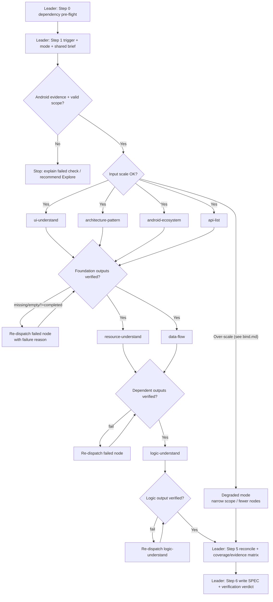

# Workflow: Legacy Android source → verified node artifacts → SPEC package

This Swarm Skill is **Mixed B+C**: a parallel decomposition (Stage A foundation nodes) feeding a specialization pipeline with hard handoff gates (Stage B resource/data-flow, Stage C logic), integrated by the Leader (`android-project-analyst` controller) into the SPEC package. Each node owns a disjoint analysis slice; the Leader never does node work and never invents claims that no node traced to source.

## Overview



## Detailed Steps

### Step 0 — Pre-flight: dependency check

- **Executor**: Leader (`android-project-analyst` controller)
- **Input**: [dependencies.yaml](dependencies.yaml)
- **Action**: verify each `tools[]` entry (`rg`, `curl`) is available; built-in Grep/Read substitute when `rg` is absent. Resource downloads degrade to `download_gaps` when `curl` is absent.
- **Output**: pre-flight note to the user
- **Quality gate**: all deps are `required: false` → the run proceeds even if missing; user is informed of any degraded mode. The Leader does NOT auto-skip nodes.

### Step 1 — Trigger verification + mode selection + shared brief

- **Executor**: Leader
- **Input**: `source_project_path`, optional `analysis_scope` / `mode` / `target_project_path` / `output_dir` / `language`, optional `jetbrains` MCP context
- **Action**: verify the target is an Android project (`AndroidManifest.xml`, `settings.gradle(.kts)`, `build.gradle(.kts)`, or a `com.android.*` module) and that the request needs structured analysis, not a one-off lookup. Select `exploration` or `migration`. Build a minimal shared brief (confirmed paths, scope, output root, Android evidence, module/build files, optional MCP evidence, known constraints).
- **Output**: announced mode banner + shared brief; default `output_dir` = `~/.a2c_agents/understand/` (SPEC under `<output_dir>/SPEC`, node artifacts under `<output_dir>/node-results/<node>`)
- **Serial / Parallel**: serial (precedes all dispatch)
- **Quality gate**: Android evidence present AND scope valid → proceed; otherwise STOP and explain the failed check (recommend a generic exploration agent for simple lookups). Migration mode without `target_project_path` → ask before producing `plan.md`.

### Step 2 — Stage A: dispatch foundation nodes (parallel, B-pattern)

- **Executor**: `ui-understand`, `architecture-pattern`, `android-ecosystem`, `api-list`
- **Input**: per-node contract `{ source_project_path, analysis_scope, mode, shared_brief, skill_spec_path (roles/<id>.md), output_dir: <output_dir>/node-results/<node>, return_format: json }`; `api-list` may also receive `ui_entry_points`
- **Action**: each node validates inputs, performs its bounded slice, writes its JSON+MD artifacts, and returns the controller JSON shape
- **Output**: `ui_understanding.*`, `architecture_pattern.*`, `android_ecosystem.*`, `api_list.*`
- **Serial / Parallel**: parallel — all four run together (slices are dispatch-time fixed, not negotiated)
- **Quality gate**: each return must be `status: "completed"` with `output_files` that exist and are non-empty. On missing/empty/non-`completed` output → re-dispatch that node with the same contract plus the failure reason (retry policy in [bind.md](bind.md) § Failure Handling). Do NOT synthesize around a failed node.

### Step 3 — Stage B: dispatch resource + data-flow nodes (gated handoff, C-pattern)

- **Executor**: `resource-understand`, `data-flow`
- **Input**: Stage A verified output paths. `resource-understand` receives optional `ui_understanding_path` / `api_list_path` / `android_ecosystem_path`; `data-flow` receives required `api_list_path` + optional `architecture_pattern_path` / `android_ecosystem_path` / `ui_understanding_path`
- **Action**: `resource-understand` maps local + online resources and safely downloads concrete URLs into `<output_dir>/node-results/resource-understand/downloaded_resources/`; `data-flow` traces sources→repositories→streams→UI state, aligning API IDs to `api_list`
- **Output**: `resource_understanding.*`, `data_flow.*`
- **Serial / Parallel**: starts only after Stage A gate passes; the two nodes may run in parallel with each other
- **Quality gate**: same return-shape + output-file checks as Step 2. If a node needs upstream data that is missing/stale, it returns `needs_rerun`/`blocked` rather than rebuilding another node's catalog.

### Step 4 — Stage C: dispatch logic node (final pipeline stage)

- **Executor**: `logic-understand`
- **Input**: required `ui_understanding_path`, `architecture_pattern_path`, `android_ecosystem_path`, `api_list_path`, `data_flow_path`
- **Action**: synthesize user-action / lifecycle / state-machine / business-rule behavior, referencing (not rebuilding) upstream catalogs
- **Output**: `logic_understanding.*`
- **Serial / Parallel**: serial — runs last, after Stage B gate passes
- **Quality gate**: return-shape + output-file checks; every major UI module from `ui_understanding_path` has logic coverage or an explicit reason for none.

### Step 5 — Integrate: reconcile verified outputs

- **Executor**: Leader
- **Input**: all verified node JSON/MD outputs
- **Action**: integrate ONLY from verified outputs. Prefer evidence with exact source paths. Mark cross-node conflicts that affect architecture/data-flow/ecosystem/migration as `Needs confirmation`. Build a **coverage matrix** (screen/module → UI → architecture role → APIs/data sources → resource usage → data flows → logic flows → ecosystem constraints) and an **evidence index** (claim → node output → source paths → confidence `verified|inferred|assumed|unknown`).
- **Output**: reconciled coverage matrix + evidence index (in-memory, feeds Step 6)
- **Serial / Parallel**: serial
- **Quality gate**: no unknowns hidden — every unresolved item lands in SPEC risks/assumptions or `Needs confirmation`.

### Step 6 — Final: write SPEC package + emit completion report

- **Executor**: Leader
- **Input**: coverage matrix + evidence index from Step 5
- **Action**: write SPEC artifacts under `<output_dir>/SPEC`. **Exploration** mode → `prd.md`, `design.md`, `verification.md`. **Migration** mode → adds `plan.md`. SPEC must synthesize, not paste node summaries; every important claim maps to node output + source path or is marked assumption/gap. `design.md` sections include a Mermaid diagram, structured table, or evidence mapping; architecture/UI-navigation/data-flow/cross-module sections include diagrams when evidence exists.
- **Output**: SPEC files + the completion report below

#### Final Report Format

```json
{
  "status": "completed",
  "mode": "exploration | migration",
  "source_project_path": "...",
  "target_project_path": "... or null",
  "node_outputs": {
    "ui_understand": ["..."],
    "architecture_pattern": ["..."],
    "android_ecosystem": ["..."],
    "api_list": ["..."],
    "resource_understand": ["..."],
    "data_flow": ["..."],
    "logic_understand": ["..."]
  },
  "spec_outputs": ["..."],
  "readiness": "ready | ready_with_assumptions | blocked",
  "blocking_gaps": []
}
```

## Acceptance Criteria

- All dispatched nodes returned outputs matching their role `## Output Schema` (no malformed returns); any `[ROLE MISSING]` is recorded per [bind.md](bind.md).
- All required node artifacts exist and are non-empty; all required SPEC artifacts for the selected mode exist and are non-empty.
- **Coverage check (B-pattern)**: every Stage A slice is accounted for — screens from `ui-understand` are represented in `design.md` or marked out of scope; APIs from `api-list` appear or are marked unknown; local/online resources from `resource-understand` appear or are marked unknown.
- **Gate check (C-pattern)**: Stage B ran only after Stage A verification; Stage C ran only after Stage B verification; every kicked-back node is recorded.
- Data-flow and logic-flow names align across `design.md`, `plan.md`, and `verification.md`.
- `verification.md` carries a readiness verdict (`ready | ready_with_assumptions | blocked`); if `blocked`, the final response lists blockers and exact missing evidence.
- No artifact claims certainty for unknown or dynamic code paths.
