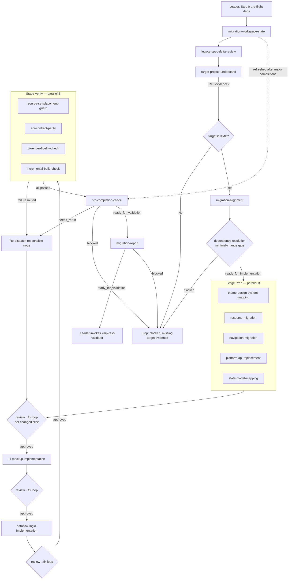

# Workflow: Legacy Android SPEC + target KMP project → migrated, validation-ready KMP code

This Swarm Skill is a **specialization pipeline (C) with embedded parallel fan-outs (B) and review→fix loops**. The `android-to-kmp-migrator` controller (Leader) verifies the trigger, dispatches nodes in a hard dependency order, gates every handoff, runs a mandatory review→fix→re-review loop after any node changes files, routes guard/parity/fidelity/build failures back to the responsible node, and invokes `kmp-test-validator` only after the migration report returns `ready_for_validation`. Implementation outputs must be fully implemented — TODO placeholders are not acceptable.

## Overview



The review→fix loop (`RFa/RFb/RFc`) is: `module-node-migration-review` → if `needs_fix`, `module-node-migration-fix` → mandatory re-review → repeat until `approved` or `blocked`. The `migration-workspace-state` ledger is refreshed after major node completions to flag stale upstream artifacts.

## Detailed Steps

### Step 0 — Pre-flight: dependency check

- **Executor**: Leader
- **Input**: [dependencies.yaml](dependencies.yaml)
- **Action**: verify each `tools[]` entry is available; the target Gradle wrapper drives builds.
- **Output**: pre-flight note to the user
- **Quality gate**: all deps `required: false`; the run proceeds with degraded behavior recorded. User decides go/no-go on anything missing; Leader does not auto-skip nodes.

### Step 1 — Trigger verification + shared brief + workspace state

- **Executor**: Leader, then `migration-workspace-state`
- **Input**: `kmp_target_project_path`, `legacy_android_project_path` (or null), `migration_scope`, `spec_dir`, optional `output_dir` (default `~/.a2c_agents/migration/`), optional `jetbrains` MCP context
- **Action**: confirm the migration trigger and Legacy SPEC context; build the shared brief; initialize/refresh the workspace-state ledger.
- **Output**: shared brief + `migration_workspace_state.*`
- **Serial / Parallel**: serial
- **Quality gate**: Legacy SPEC context present (or `android-project-analyst` is invoked first); else stop with a user-visible blocker.

### Step 2 — Analysis chain: delta review → target understand → alignment

- **Executor**: `legacy-spec-delta-review` → `target-project-understand` → `migration-alignment`
- **Input**: SPEC paths, target path, shared brief; alignment additionally consumes delta-review + target-understanding outputs
- **Action**: verify SPEC coverage vs raw source; understand the target & reuse inventory; build the source-to-target map, integration scaffold, and ordered tasks.
- **Output**: `spec_delta_review.*`, `target_project_understanding.*` + `target_migration_context.md`, `migration_alignment.*` + `migration_implementation_map.md`
- **Serial / Parallel**: serial (each consumes the prior)
- **Quality gate**: `target-project-understand` must confirm a KMP project, else `blocked`. Each return is `completed`/`blocked` with verified non-empty `output_files`, else re-dispatch.

### Step 3 — Dependency gate

- **Executor**: `dependency-resolution`
- **Input**: target-understanding + alignment + SPEC paths
- **Action**: map required capabilities to baseline/reuse, apply the minimal-change gate, justify any build-config change.
- **Output**: `dependency_resolution.*`
- **Serial / Parallel**: serial — blocks all implementation
- **Quality gate**: status must be `ready_for_implementation`; `blocked` halts implementation with the unmet capability. Implementation nodes do NOT run until this passes.

### Step 4 — Stage Prep (parallel, B-pattern)

- **Executor**: `theme-design-system-mapping`, `resource-migration`, `navigation-migration`, `platform-api-replacement`, `state-model-mapping`
- **Input**: alignment + dependency outputs + relevant Legacy understanding paths
- **Action**: prepare visual tokens, resources, routes, platform abstractions, and state/models before UI.
- **Output**: each node's `*.json`/`*.md` + changed target files
- **Serial / Parallel**: parallel — slices are dispatch-time fixed
- **Quality gate**: each return verified (output + changed files); any node that changed files enters the Step 5 review→fix loop before its slice is consumed downstream.

### Step 5 — Review→fix loop (after any file-changing node)

- **Executor**: `module-node-migration-review` → `module-node-migration-fix` (conditional) → re-review
- **Input**: owning-node output, changed files, upstream evidence, workspace state
- **Action**: review one slice; if `needs_fix`, apply only assigned `must_fix` findings inside `allowed_files`, then mandatorily re-review.
- **Output**: `module_node_migration_review.*`, `module_node_migration_fix.*` (when fixes ran)
- **Serial / Parallel**: serial per slice; runs after Prep (5a), after UI (5b), and after dataflow/logic (5c)
- **Quality gate**: loop until review returns `approved` or `blocked`. A fix output with `requires_re_review: true` MUST be followed by a re-review before any downstream gate consumes the slice; max fix↔review cycles per [bind.md](bind.md).

### Step 6 — UI implementation → review→fix loop

- **Executor**: `ui-mockup-implementation`, then Step 5 loop (5b)
- **Input**: alignment, dependency, theme, resource, navigation, target outputs
- **Action**: implement the visible UI surface first, exposing binding surfaces; no TODO placeholders.
- **Output**: `ui_impl_result.*` + changed UI/resource files
- **Serial / Parallel**: serial — runs after Prep approved
- **Quality gate**: every in-scope visible requirement implemented or explicitly `blocked`; slice approved via 5b before logic runs.

### Step 7 — Dataflow/logic implementation → review→fix loop

- **Executor**: `dataflow-logic-implementation`, then Step 5 loop (5c)
- **Input**: alignment, dependency, navigation, platform, state, resource, and UI outputs
- **Action**: implement models/repositories/APIs/logic bound to UI surfaces; no Android-only leak into `commonMain`; no TODO placeholders.
- **Output**: `dataflow_logic_impl_result.*` + changed logic/data/API files
- **Serial / Parallel**: serial — runs after UI approved
- **Quality gate**: slice approved via 5c before verification.

### Step 8 — Stage Verify (parallel, B-pattern) with failure routing

- **Executor**: `source-set-placement-guard`, `api-contract-parity`, `ui-render-fidelity-check`, `incremental-build-check`
- **Input**: changed files + the relevant implementation/prep/target outputs
- **Action**: check source-set placement, API parity, UI render, and an incremental build.
- **Output**: each node's `*.json`/`*.md` (+ build logs)
- **Serial / Parallel**: parallel
- **Quality gate**: each `passed`/`failed`/`blocked`. Any `failed`/violation is routed to the responsible implementation node, which re-runs and re-enters the review→fix loop. `blocked` (e.g., no trustworthy build command) is surfaced, not invented.

### Step 9 — PRD completion check

- **Executor**: `prd-completion-check`
- **Input**: raw user task + PRD/SPEC + all node outputs + review/fix outputs + verification outputs + changed files
- **Action**: judge requirement coverage, completion areas, migration invariants, incomplete markers, review-fix readiness, and guard/parity/fidelity/build results.
- **Output**: `prd_completion_check.*`
- **Serial / Parallel**: serial
- **Quality gate**: `ready_for_validation` → Step 10; `needs_rerun` → route requests to responsible nodes (re-enter the relevant stage + loop); `blocked` → stop with missing evidence.

### Step 10 — Final: migration report → validation handoff

- **Executor**: `migration-report`, then Leader
- **Input**: workspace state, all node outputs, review/fix outputs, completion check
- **Action**: synthesize the final report and validation inputs; Leader invokes `kmp-test-validator` only when the report returns `ready_for_validation`.
- **Output**: `migration_report.*` + the controller completion summary below

#### Final Report Format

```json
{
  "status": "ready_for_validation | blocked",
  "migration_scope": "...",
  "kmp_target_project_path": "...",
  "legacy_android_project_path": "... or null",
  "changed_files_by_node": [],
  "source_to_target_summary": [],
  "coverage_summary": { "ui": "", "resources": "", "navigation": "", "platform": "", "state_models": "", "data_api": "", "logic": "" },
  "module_node_review_summary": [],
  "validation_inputs": [],
  "limitations": [],
  "manual_steps": [],
  "blocking_gaps": []
}
```

## Acceptance Criteria

- Every dispatched node returned output matching its role `## Output Schema` and the shared return shape; any `[ROLE MISSING]` is recorded per [bind.md](bind.md).
- **Gate check (C-pattern)**: the dependency gate passed before implementation; UI ran before logic; each stage ran only after the prior stage's slices were `approved`.
- **Loop check**: every file-changing node has an `approved` latest review; every fix output was followed by a re-review for the same scope.
- **Coverage check (B-pattern)**: all Prep slices and all four Verify checks accounted for; failures routed to the responsible node, not absorbed by the Leader.
- Migration invariants hold: no Android-only API in `commonMain`, expect/actual complete, dependency gate respected, single KMP project, cross-module integration wired.
- No changed file contains a TODO/placeholder presented as completion output.
- `migration-report` returns `ready_for_validation` only when `prd-completion-check` is ready; `kmp-test-validator` is invoked only afterward. If `blocked`, the final response lists blockers and exact missing evidence.
