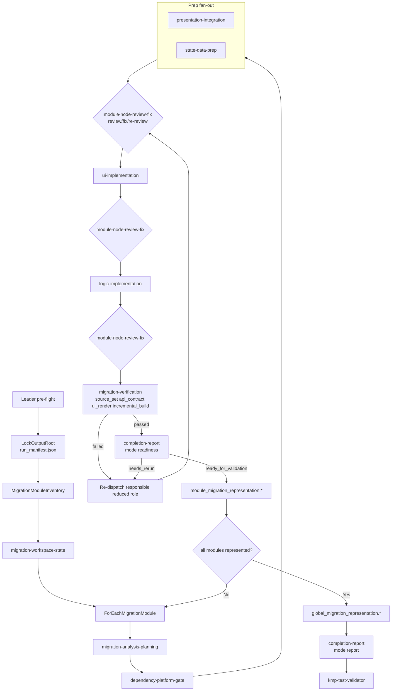

# Workflow: Legacy Android SPEC + target KMP project -> migrated, validation-ready KMP code

This workflow uses the reduced 10-role module-first migrator. Adjacent responsibilities are consolidated, but gates remain explicit through role modes, check IDs, and exact output paths.

## Overview



## Strict Output Roots

```text
output_root = <output_dir or ~/.a2c_agents/migration>/android-to-kmp-migrator
module_index_dir = <output_root>/module-index
module_root = <output_root>/modules/<migration_module_id>
node_result_dir = <module_root>/node-results/<node_id>
module_representation_dir = <module_root>/representation
global_dir = <output_root>/global
report_dir = <output_root>/report
```

## Detailed Steps

### Step 0 — Pre-flight

- **Executor**: Leader
- **Input**: [dependencies.yaml](dependencies.yaml)
- **Action**: check optional tools (`rg`, `git`, `curl`) and report degraded behavior.
- **Gate**: missing optional tools do not skip nodes; the controller records degraded evidence.

### Step 1 — Trigger + Output Root

- **Executor**: Leader
- **Input**: `legacy_android_project_path` or completed SPEC, `kmp_target_project_path`, `migration_scope`, optional `output_dir`
- **Action**: verify migration trigger, verify analyst completion, lock `output_root`, write `<output_root>/run_manifest.json`.
- **Gate**: stop if target is not KMP-compatible or analyst completion is missing/stale.

### Step 2 — Migration Module Inventory

- **Executor**: Leader
- **Action**: divide the requested migration into deterministic `migration_module_id` slices.
- **Output**:
  - `<module_index_dir>/migration_module_inventory.json`
  - `<module_index_dir>/migration_module_inventory.md`
  - `<module_root>/module_brief.json` for every scheduled module
- **Gate**: every module has `module_scope`, UI/logic/data/resource scope, target placement hints, `allowed_target_files`, and `allowed_source_sets`.

### Step 3 — Workspace State

- **Executor**: `migration-workspace-state`
- **Output**: `<global_dir>/node-results/migration-workspace-state/migration_workspace_state.*`
- **Gate**: stale upstream outputs must be rerun before downstream consumption.

### Step 4 — Module Analysis And Planning

- **Executor**: `migration-analysis-planning`
- **Input**: module brief, SPEC paths, analyst artifacts, target path, workspace state
- **Action**: verify SPEC/raw-source deltas, capture target KMP context/reuse inventory, produce source-to-target map and ordered implementation plan.
- **Output**: `<module_root>/node-results/migration-analysis-planning/migration_analysis_planning.*`
- **Gate**: target KMP evidence and source-to-target map must exist before dependency/platform work.

### Step 5 — Dependency And Platform Gate

- **Executor**: `dependency-platform-gate`
- **Input**: planning output, target baseline, allowed files/source sets
- **Action**: apply minimal-change dependency gate and define/implement safe platform boundaries when required.
- **Output**: `<module_root>/node-results/dependency-platform-gate/dependency_platform_gate.*`
- **Gate**: returns `ready_for_implementation` or `blocked`; no prep/implementation proceeds on blocked platform/dependency capability.

### Step 6 — Prep Fan-Out

- **Executors**: `presentation-integration`, `state-data-prep`
- **Action**:
  - `presentation-integration`: theme tokens, resource migration/modeling, navigation routes.
  - `state-data-prep`: state holders, models, mappers, API/data expectations, logic handoff.
- **Output**:
  - `<module_root>/node-results/presentation-integration/presentation_integration.*`
  - `<module_root>/node-results/state-data-prep/state_data_prep.*`
- **Gate**: every file-changing prep slice enters review/fix before UI or logic consumes it.

### Step 7 — Review/Fix Loop

- **Executor**: `module-node-review-fix`
- **Modes**:
  - `review`: read-only review of one module/node slice.
  - `fix`: scoped edit of explicit `must_fix` findings inside `allowed_files`.
- **Gate**: every fix must be followed by a fresh review. Downstream nodes may consume only slices whose latest review is `approved`.

### Step 8 — UI Implementation

- **Executor**: `ui-implementation`
- **Action**: implement visible UI surface first, including states/resources and binding surfaces.
- **Gate**: UI output is reviewed/approved before logic implementation.

### Step 9 — Logic Implementation

- **Executor**: `logic-implementation`
- **Action**: implement repositories/use cases/API integration/business logic bound to approved UI surfaces.
- **Gate**: logic output is reviewed/approved before verification.

### Step 10 — Verification

- **Executor**: `migration-verification`
- **Required `check_ids`**:
  - `source_set`
  - `api_contract`
  - `ui_render`
  - `incremental_build`
- **Output**: `<module_root>/node-results/migration-verification/migration_verification.*`
- **Gate**: failures route to the responsible reduced role and re-enter review/fix.

### Step 11 — Readiness And Module Representation

- **Executor**: `completion-report` in `mode: readiness`, then Leader
- **Action**: decide module readiness; write module representation.
- **Output**:
  - `<module_root>/node-results/completion-report/readiness/completion_readiness.*`
  - `<module_representation_dir>/module_migration_representation.json`
  - `<module_representation_dir>/module_migration_representation.md`
- **Gate**: blocked modules still write a representation with blockers.

### Step 12 — Global Representation

- **Executor**: Leader
- **Input**: all module representations
- **Output**:
  - `<global_dir>/global_migration_representation.json`
  - `<global_dir>/global_migration_representation.md`
- **Gate**: final report cannot run until global representation exists and is non-empty.

### Step 13 — Final Report And Validation Handoff

- **Executor**: `completion-report` in `mode: report`, then Leader
- **Output**:
  - `<report_dir>/migration_report.json`
  - `<report_dir>/migration_report.md`
- **Gate**: report mode may return `ready_for_validation` only after module/global representations exist and readiness has passed. Leader invokes `kmp-test-validator` afterward.

## Final Report Shape

```json
{
  "status": "ready_for_validation | blocked",
  "migration_scope": "",
  "kmp_target_project_path": "",
  "legacy_android_project_path": "",
  "output_root": "",
  "migration_module_inventory": "",
  "module_representations": [],
  "global_migration_representation": "",
  "changed_files_by_role": [],
  "source_to_target_summary": [],
  "coverage_summary": {
    "presentation": "",
    "state_data": "",
    "ui": "",
    "logic": "",
    "platform": "",
    "verification": ""
  },
  "validation_inputs": [],
  "limitations": [],
  "manual_steps": [],
  "blocking_gaps": []
}
```

## Acceptance Criteria

- Active dispatch uses only the 10 reduced role IDs from `SKILL.md`.
- Every module has a `module_brief.json`, verified node outputs under `<module_root>/node-results/`, and a module migration representation.
- Review/fix invocations are separate: `review` -> optional `fix` -> fresh `review`.
- Verification uses stable `check_ids` and routes failures to reduced role IDs.
- No Android-only API leaks into `commonMain`; dependency changes pass the minimal-change gate.
- `global_migration_representation.*` exists before report mode.
- `kmp-test-validator` is invoked only after `completion-report` report mode returns `ready_for_validation`.
