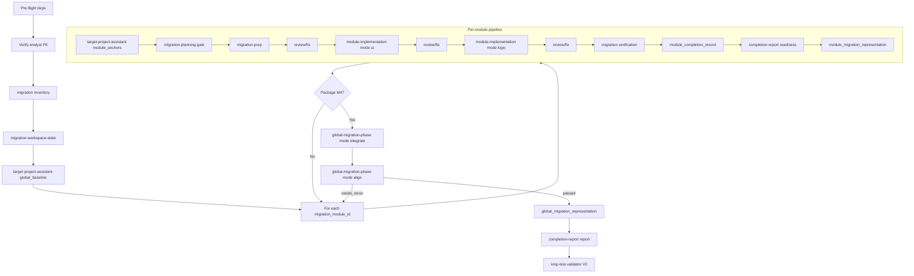

# Workflow: Analyst P6 → module-first migration → kmp-test-validator

See [output-contract.md](output-contract.md) and active role IDs in [SKILL.md](SKILL.md).

## Skill Chain (mandatory)

| Phase | Skill | Gate | Leader rule |
|---|---|---|---|
| Prerequisite | `android-project-analyst` | **P6** | MUST finish before `android-to-kmp-migrator` is invoked. Missing/stale P6 → `blocked`; dispatch analyst first. |
| Migration | `android-to-kmp-migrator` | **M0**–**V0** | Runs only after P6 verified; ends with `migration_report.*` and **V0** ready. |
| Post-migration | `kmp-test-validator` | **V0** | MUST be invoked after migrator completes **V0** (MG17). Do not end the migration workflow without validator dispatch. |

## Target KMP Edit Flow

After analyst **P6** understanding (read-only), the migrator **edits** `kmp_target_project_path`:

1. **Per module**: `migration-prep` (optional scaffold) → `module-implementation` `ui` → `logic` (required target edits) → review/fix remediation as needed.
2. **Global**: `global-migration-phase` `integrate` edits cross-module glue and entry-point wiring.
3. **Align** is read-only verification — reruns integrate or module implementation when target edits are missing or wrong.

Planning and TPA artifacts route edits; they do not replace implementation.

## Overview

## Step 0 — Pre-flight

- **Executor**: Leader
- **Input**: [dependencies.yaml](dependencies.yaml) — `tools[]` (`rg`, `git`, `curl`), `optional_mcp.jetbrains`, `upstream_inputs` analyst **P6**; the **user input / migration request**
- **Output**: `run_manifest.json` → `dependency_preflight` (CLI status, MCP availability, P6 readiness pointer) and `design_mode` (architecture pattern decision)
- **Gate**: missing CLI tools → degraded modes per dependencies.yaml; `android-project-analyst` **P6** not ready → **blocked** — invoke analyst first, do not dispatch migrator nodes

### Step 0a — Identify design mode (default MVI)

- Scan the **user input** for an explicit or implied presentation architecture:
  - **`mvvm`** signals: "MVVM", shared `ViewModel`, `StateFlow` / `uiState`, `viewModelScope`, `collectAsStateWithLifecycle`, KMP-ObservableViewModel, SKIE → `references/kmp-mvvm.md`
  - **`mvi`** signals: "MVI", FlowRedux, state machine, reducer, intent, unidirectional, sealed `State`/`Action`, `dispatch`, `inState`, `onEnter` → `references/kmp-mvi-flowredux.md`
- **No clear signal → default `mvi`.**
- Record `design_mode: { value: "mvi | mvvm", source: "user_input | default", signals: [], architecture_reference_path: "" }` in `run_manifest.json`.
- Freeze `design_mode` for the run; pass `design_mode` + `architecture_reference_path` into every architecture-producing dispatch (planning-gate, prep, module-implementation, module-node-review-fix, global-migration-phase) and to TPA for target-pattern detection.

## Step 1 — Upstream + output root

- Verify analyst package **P6**; write `upstream_analyst_index.json`.

## Step 2 — Migration inventory

- `migration_module_inventory.*`, `modules_migration_index.json`, per-module `module_brief.json`.

## Step 3 — Workspace state

- Init ledger; track handoff gates **M0**–**V0**.

## Step 4 — Target project assistant (global)

- `mode: global_baseline` → `target_alignment_revision.*`

## Step 5 — Per-module pipeline

| Step | Role | Notes |
|---|---|---|
| 5a | TPA `module_anchors` | Package **M2** per module |
| 5b | `migration-planning-gate` | Planning + dep/platform in one pass |
| 5c | `migration-prep` | Presentation + state/data + `analytics_expectations[]` |
| 5d | `module-node-review-fix` | After prep if file-changing |
| 5e | `module-implementation` `ui` | Edit/create target KMP UI files; then review/fix |
| 5f | `module-implementation` `logic` | Edit/create target KMP logic + **埋点** restoration; then review/fix |
| 5g | `migration-verification` | Static + restoration incl. **analytics_restoration** (埋点 parity); **no full build** |
| 5h | Leader | `module_completion_record.json` |
| 5i | `completion-report` `readiness` + module representation | Package **M3** |

Repeat until package **M4**.

## Step 6 — Global migration phase

### 6a Integrate

- **Role**: `global-migration-phase` `mode: integrate`
- **Action**: edit target KMP cross-module glue (nav, DI, shared contracts), **wire app-shell entry points** (launcher, Application/startup, root NavHost start destination, deep links), and **analytics SDK/init/facade** when legacy uses analytics, under `kmp_target_project_path`, using TPA `entry_point_anchors[]` and analyst `presentation_resource` `entry_points[]`
- **Output**: `global-migration-phase/integrate/global_system_integration.*` with `integration_changed_files[]`, `entry_point_wiring[]`, and `analytics_sdk_wiring[]`
- **Gate**: package **M5**

### 6b Align

- **Role**: `global-migration-phase` `mode: align`
- **Action**: read-only comparison including **entry point alignment** and **analytics alignment** — verify each Android entry resolves to the correct KMP shell path; verify legacy 埋点 inventory matches migrated track/report calls and global analytics SDK wiring
- **Output**: `global-migration-phase/align/post_integration_alignment.*` with `entry_point_alignment_results[]`, `analytics_alignment_results[]`, `global_alignment_results.entry_points`, `global_alignment_results.analytics`, plus `report/alignment_report.*`
- **Gate**: package **M6**; entry point, analytics SDK, or cross-module mismatch → `rerun_global_integration` or module loop

## Step 7 — Report + mandatory validator handoff (MG17)

- Global representation + `completion-report` `report` → package **V0**
- **Leader MUST invoke `kmp-test-validator`** with `migration_report.*`, analyst SPEC paths, and `kmp_target_project_path`
- Record `validator_handoff` in workspace ledger (`dispatched | pending | blocked`)
- Migrator workflow is **incomplete** until validator is dispatched or explicit validator blockers are recorded

## TPA consult

Any target question → TPA `mode: consult` (append `consultation_log`).

## Acceptance Criteria

- `android-project-analyst` **P6** verified before any migrator module dispatch.
- `design_mode` identified from user input at Step 0 (default `mvi`) and recorded in `run_manifest.json`; architecture-producing dispatches carry `design_mode` + `architecture_reference_path`.
- Target KMP files created or updated under `kmp_target_project_path` for every module requiring implementation; `target_changed_files[]` aggregated in `migration_report.json`.
- `kmp-test-validator` invoked after **V0** — mandatory MG17 step.
- Dispatch only role IDs from `SKILL.md`.
- Mode rules: `ui` before `logic`; `integrate` before `align`; `review`/`fix` separate.
- `migration-verification` never runs `incremental_build`.
- Per-module and global **analytics_restoration** (埋点) parity verified before **M3** / **M6**; runtime analytics **reporting** deferred to `kmp-test-validator`.
- `handoff_gates` match output-contract.
