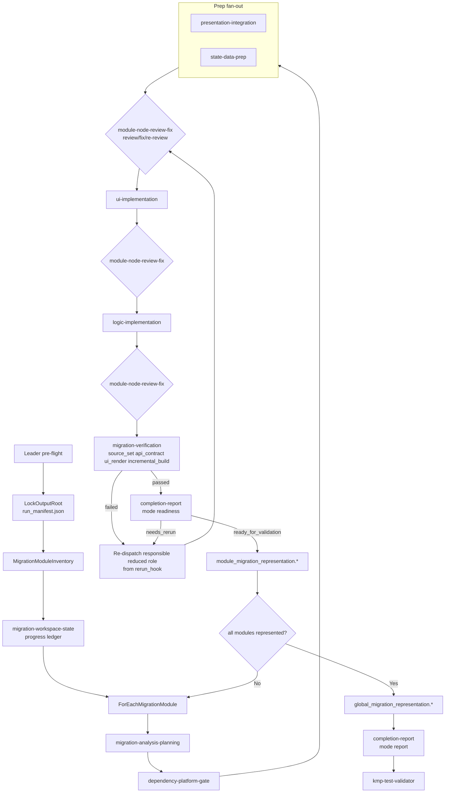

# Workflow: Legacy Android SPEC + target KMP project -> migrated, validation-ready KMP code

This workflow uses the reduced 10-role module-first migrator. Adjacent responsibilities are consolidated, but gates remain explicit through role modes, check IDs, exact output paths, and a workspace-state progress ledger that tracks per-module finish rates, plan-vs-code gaps, and rerun hooks.

## Overview



## Strict Output Roots

```text
output_root = <output_dir or ~/.a2c_agents/migration>/android-to-kmp-migrator
module_index_dir = <output_root>/module-index
module_root = <output_root>/modules/<migration_module_id>
node_result_dir = <module_root>/node-results/<node_id>
module_representation_dir = <module_root>/representation
global_dir = <output_root>/global
report_dir = <output_root>/report
```

## Detailed Steps

### Step 0 — Pre-flight

- **Executor**: Leader
- **Input**: [dependencies.yaml](dependencies.yaml)
- **Action**: check optional tools (`rg`, `git`, `curl`) and report degraded behavior.
- **Output**: pre-flight status recorded in `run_manifest.json` and later workspace-state artifacts.
- **Gate**: missing optional tools do not skip nodes; the controller records degraded evidence.

### Step 1 — Trigger + Output Root

- **Executor**: Leader
- **Input**: `legacy_android_project_path` or completed SPEC, `kmp_target_project_path`, `migration_scope`, optional `output_dir`
- **Action**: verify migration trigger, verify analyst completion, lock `output_root`, write `<output_root>/run_manifest.json`.
- **Output**: `<output_root>/run_manifest.json` containing Android/SPEC inputs, KMP target path, migration scope, output root, allowed roots, dependency-preflight status, schedule version, and timestamp.
- **Gate**: stop if target is not KMP-compatible or analyst completion is missing/stale.

### Step 2 — Migration Module Inventory

- **Executor**: Leader
- **Action**: divide the requested migration into deterministic `migration_module_id` slices.
- **Output**:
  - `<module_index_dir>/migration_module_inventory.json`: module ids/order, scope slices, target placement hints, allowed files/source sets, module output roots, blockers.
  - `<module_index_dir>/migration_module_inventory.md`: agent-readable module schedule and boundary evidence.
  - `<module_root>/module_brief.json` for every scheduled module: module dispatch contract, evidence paths, role hints, allowed files/source sets, assumptions.
- **Gate**: every module has `module_scope`, UI/logic/data/resource scope, target placement hints, `allowed_target_files`, and `allowed_source_sets`.

### Step 3 — Workspace State

- **Executor**: `migration-workspace-state`
- **Input**: migration module inventory, module briefs, node outputs, changed files, planning outputs, implementation outputs, review outputs, verification outputs, representation outputs, source change/timestamp evidence, rerun reports, blockers.
- **Action**: initialize and refresh a progress ledger. Track per-module current stage, stage status, planned/completed work units, `finish_rate`, changed-file ownership, plan-vs-code gaps, stale outputs, rerun hooks, blockers, and next safe actions.
- **Output**:
  - `<global_dir>/node-results/migration-workspace-state/migration_workspace_state.json`, `.md`: global/module progress ledger, aggregate finish rate, stale/blocked modules, rerun hooks.
  - `<module_root>/node-results/migration-workspace-state/migration_workspace_state.json`, `.md`: module stage status, finish rate, changed-file ownership, plan-vs-code gaps, stale outputs, rerun hooks.
- **Gate**: stale upstream outputs, failed stages, missing review/verification, or non-empty `rerun_hooks` must be routed before downstream consumption. A downstream stage may consume a module only when the latest module progress record marks its required upstream stages fresh and usable.

### Workspace State Refresh Points

The Leader refreshes `migration-workspace-state` after each major stage, and before any downstream role consumes newly produced artifacts:

| Refresh point | Required progress evidence |
|---|---|
| After module inventory | module list, module briefs, planned stage schedule |
| After planning | planned work units, source-to-target map, expected artifacts |
| After dependency/platform gate | dependency/platform readiness and blockers |
| After prep fan-out | presentation/state-data prep outputs and changed-file ownership |
| After every review/fix/re-review | latest review status, fix ownership, unresolved findings |
| After UI implementation | UI coding artifacts, plan coverage, review hook if needed |
| After logic implementation | logic coding artifacts, plan coverage, review hook if needed |
| After verification | check status, failed check routing, verification-required gaps |
| After readiness/module representation | module status and representation artifacts |
| After global representation/report | aggregate finish rate, stale module list, validation handoff readiness |

### Step 4 — Module Analysis And Planning

- **Executor**: `migration-analysis-planning`
- **Input**: module brief, SPEC paths, analyst artifacts, target path, workspace state
- **Action**: verify SPEC/raw-source deltas, capture target KMP context/reuse inventory, produce source-to-target map and ordered implementation plan.
- **Output**: `<module_root>/node-results/migration-analysis-planning/migration_analysis_planning.json`, `.md`. The artifacts must contain SPEC/raw-source deltas, target KMP evidence, reuse inventory, source-to-target map, resource project map, integration scaffold, ordered implementation tasks, blockers.
- **Gate**: target KMP evidence and source-to-target map must exist before dependency/platform work.
- **Workspace-state update**: record planned work units and initial `finish_rate` basis. If the plan is incomplete, `migration-workspace-state` emits a rerun hook to `migration-analysis-planning`.

### Step 5 — Dependency And Platform Gate

- **Executor**: `dependency-platform-gate`
- **Input**: planning output, target baseline, allowed files/source sets
- **Action**: apply minimal-change dependency gate and define/implement safe platform boundaries when required.
- **Output**: `<module_root>/node-results/dependency-platform-gate/dependency_platform_gate.json`, `.md`. The artifacts must contain capability map, dependency/build decisions, platform capability boundaries, expect/actual/source-set plan, changed files, implementation constraints, blockers.
- **Gate**: returns `ready_for_implementation` or `blocked`; no prep/implementation proceeds on blocked platform/dependency capability.
- **Workspace-state update**: record dependency/platform stage status and pause downstream consumers when blocked.

### Step 6 — Prep Fan-Out

- **Executors**: `presentation-integration`, `state-data-prep`
- **Action**:
  - `presentation-integration`: theme tokens, resource migration/modeling, navigation routes.
  - `state-data-prep`: state holders, models, mappers, API/data expectations, logic handoff.
- **Output**:
  - `<module_root>/node-results/presentation-integration/presentation_integration.json`, `.md`: token/component/resource/media/route mappings, UI handoff, changed files, presentation gaps.
  - `<module_root>/node-results/state-data-prep/state_data_prep.json`, `.md`: state holders, UI state/events/effects, model/mappers, API/data contract expectations, logic handoff, changed files.
- **Gate**: every file-changing prep slice enters review/fix before UI or logic consumes it.
- **Workspace-state update**: record changed-file ownership and plan-vs-code gaps for prep outputs; emit review rerun hooks when file-changing slices lack review approval.

### Step 7 — Review/Fix Loop

- **Executor**: `module-node-review-fix`
- **Modes**:
  - `review`: read-only review of one module/node slice.
  - `fix`: scoped edit of explicit `must_fix` findings inside `allowed_files`.
- **Gate**: every fix must be followed by a fresh review. Downstream nodes may consume only slices whose latest review is `approved`.
- **Output**:
  - Review mode: `<module_root>/node-results/module-node-review-fix/<owning_node>/review/module_node_review.json`, `.md` with read-only findings, reviewed files, approval/needs-fix status, blockers.
  - Fix mode: `<module_root>/node-results/module-node-review-fix/<owning_node>/fix/module_node_fix.json`, `.md` with fixed/unfixed findings, changed files, `requires_re_review: true`, blockers.
- **Workspace-state update**: record review status by owner node and planned work unit. `needs_fix` and missing re-review produce rerun hooks.

### Step 8 — UI Implementation

- **Executor**: `ui-implementation`
- **Action**: implement visible UI surface first, including states/resources and binding surfaces.
- **Output**: `<module_root>/node-results/ui-implementation/ui_implementation.json`, `.md` with changed UI/resource files, UI coverage, fidelity notes, binding surfaces, diagnostics, blockers.
- **Gate**: UI output is reviewed/approved before logic implementation.
- **Workspace-state update**: record UI implementation progress, changed files, missing planned UI work, unplanned UI changes, and required review hooks.

### Step 9 — Logic Implementation

- **Executor**: `logic-implementation`
- **Action**: implement repositories/use cases/API integration/business logic bound to approved UI surfaces.
- **Output**: `<module_root>/node-results/logic-implementation/logic_implementation.json`, `.md` with changed logic/data/API files, architecture alignment, platform boundaries, data flows, API integrations, logic coverage, diagnostics, blockers.
- **Gate**: logic output is reviewed/approved before verification.
- **Workspace-state update**: record logic implementation progress, changed files, missing planned logic work, unplanned logic changes, and required review hooks.

### Step 10 — Verification

- **Executor**: `migration-verification`
- **Required `check_ids`**:
  - `source_set`
  - `api_contract`
  - `ui_render`
  - `incremental_build`
- **Output**: `<module_root>/node-results/migration-verification/migration_verification.json`, `.md`, plus log files when commands run. The artifacts must contain stable `check_results`, evidence, failures, routed owner nodes, command/log paths, blockers.
- **Gate**: failures route to the responsible reduced role and re-enter review/fix.
- **Workspace-state update**: record verification status, failed check ids, `route_to_node`, and rerun hooks that pause readiness until resolved.

### Step 11 — Readiness And Module Representation

- **Executor**: `completion-report` in `mode: readiness`, then Leader
- **Action**: decide module readiness; write module representation.
- **Output**:
  - `<module_root>/node-results/completion-report/readiness/completion_readiness.json`, `.md`: requirement coverage, invariants, review/verification status, rerun requests, blockers.
  - `<module_representation_dir>/module_migration_representation.json`: machine synthesis of verified module migration outputs, changed files by role, coverage, gaps, evidence.
  - `<module_representation_dir>/module_migration_representation.md`: agent-readable module migration handoff and traceability.
- **Gate**: blocked modules still write a representation with blockers.
- **Workspace-state update**: record module representation artifacts, final module finish rate, and remaining blockers without issuing the final report verdict.

### Step 12 — Global Representation

- **Executor**: Leader
- **Input**: all module representations
- **Output**:
  - `<global_dir>/global_migration_representation.json`: machine synthesis of module representations, cross-module target changes, shared ownership, coverage, blockers.
  - `<global_dir>/global_migration_representation.md`: agent-readable global migration handoff and validation prerequisites.
- **Gate**: final report cannot run until global representation exists and is non-empty.
- **Workspace-state update**: record aggregate finish rate, represented modules, blocked/stale modules, and report blockers.

### Step 13 — Final Report And Validation Handoff

- **Executor**: `completion-report` in `mode: report`, then Leader
- **Output**:
  - `<report_dir>/migration_report.json`: validation-ready machine handoff with scope, paths, module/global representations, changed files by role, coverage, validation inputs, limitations, blockers.
  - `<report_dir>/migration_report.md`: agent-readable migration report for validator and follow-up agents.
- **Gate**: report mode may return `ready_for_validation` only after module/global representations exist and readiness has passed. Leader invokes `kmp-test-validator` afterward.
- **Workspace-state update**: final refresh records report artifacts and validation handoff readiness.

## Final Report Shape

```json
{
  "status": "ready_for_validation | blocked",
  "migration_scope": "",
  "kmp_target_project_path": "",
  "legacy_android_project_path": "",
  "output_root": "",
  "migration_module_inventory": "",
  "module_representations": [],
  "global_migration_representation": "",
  "changed_files_by_role": [],
  "source_to_target_summary": [],
  "coverage_summary": {
    "presentation": "",
    "state_data": "",
    "ui": "",
    "logic": "",
    "platform": "",
    "verification": ""
  },
  "validation_inputs": [],
  "limitations": [],
  "manual_steps": [],
  "blocking_gaps": []
}
```

## Acceptance Criteria

- Active dispatch uses only the 10 reduced role IDs from `SKILL.md`.
- Every module has a `module_brief.json`, verified node outputs under `<module_root>/node-results/`, and a module migration representation.
- Latest `migration-workspace-state` includes `module_progress`, `finish_rate`, `plan_code_gaps`, and `rerun_hooks` for every scheduled module.
- No downstream stage consumes a module when its latest workspace-state record has stale required inputs, unresolved blocking plan-vs-code gaps, missing review approval, missing verification, or blocking rerun hooks.
- Review/fix invocations are separate: `review` -> optional `fix` -> fresh `review`.
- Verification uses stable `check_ids` and routes failures to reduced role IDs.
- No Android-only API leaks into `commonMain`; dependency changes pass the minimal-change gate.
- `global_migration_representation.*` exists before report mode.
- `kmp-test-validator` is invoked only after `completion-report` report mode returns `ready_for_validation`.
