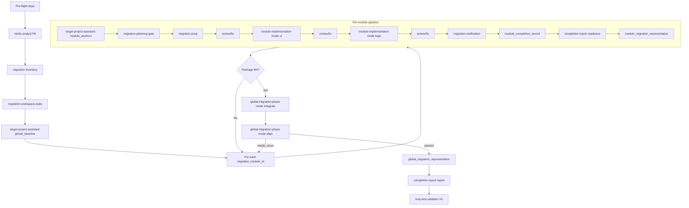

# Workflow: Analyst P6 → module-first migration → kmp-test-validator

See [output-contract.md](output-contract.md) and active role IDs in [SKILL.md](SKILL.md).

## Overview

## Step 0 — Pre-flight

- **Executor**: Leader
- **Input**: [dependencies.yaml](dependencies.yaml) — `tools[]` (`rg`, `git`, `curl`), `optional_mcp.jetbrains`, `upstream_inputs` analyst **P6**
- **Output**: `run_manifest.json` → `dependency_preflight` (CLI status, MCP availability, P6 readiness pointer)
- **Gate**: missing CLI tools → degraded modes per dependencies.yaml; analyst P6 not ready → **blocked** before module dispatch

## Step 1 — Upstream + output root

- Verify analyst package **P6**; write `upstream_analyst_index.json`.

## Step 2 — Migration inventory

- `migration_module_inventory.*`, `modules_migration_index.json`, per-module `module_brief.json`.

## Step 3 — Workspace state

- Init ledger; track handoff gates **M0**–**V0**.

## Step 4 — Target project assistant (global)

- `mode: global_baseline` → `target_alignment_revision.*`

## Step 5 — Per-module pipeline

| Step | Role | Notes |
|---|---|---|
| 5a | TPA `module_anchors` | Package **M2** per module |
| 5b | `migration-planning-gate` | Planning + dep/platform in one pass |
| 5c | `migration-prep` | Presentation + state/data in one pass |
| 5d | `module-node-review-fix` | After prep if file-changing |
| 5e | `module-implementation` `ui` | Then review/fix |
| 5f | `module-implementation` `logic` | After UI approved; then review/fix |
| 5g | `migration-verification` | Static + restoration; **no full build** |
| 5h | Leader | `module_completion_record.json` |
| 5i | `completion-report` `readiness` + module representation | Package **M3** |

Repeat until package **M4**.

## Step 6 — Global migration phase

### 6a Integrate

- **Role**: `global-migration-phase` `mode: integrate`
- **Output**: `global-migration-phase/integrate/global_system_integration.*`
- **Gate**: package **M5**

### 6b Align

- **Role**: `global-migration-phase` `mode: align`
- **Output**: `global-migration-phase/align/post_integration_alignment.*`, `report/alignment_report.*`
- **Gate**: package **M6**; `needs_rerun` → module loop or re-integrate

## Step 7 — Report + validator

- Global representation + `completion-report` `report` → package **V0** → `kmp-test-validator`

## TPA consult

Any target question → TPA `mode: consult` (append `consultation_log`).

## Acceptance Criteria

- Dispatch only role IDs from `SKILL.md`.
- Mode rules: `ui` before `logic`; `integrate` before `align`; `review`/`fix` separate.
- `migration-verification` never runs `incremental_build`.
- `handoff_gates` match output-contract.
