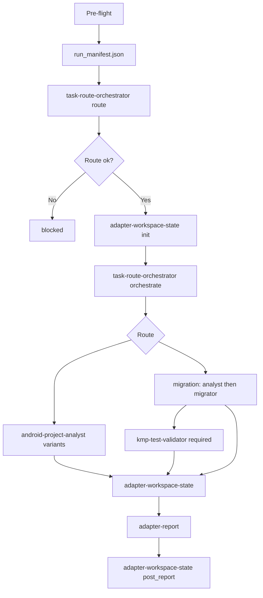

# Workflow: task → route → downstream workflow → adapter report

The adapter classifies intent, records contracts and stage gates, and emits a verified report. It does not perform analysis, migration, or validation itself.

**File recording system**: every adapter output path, content requirement, and trigger gate is defined in [output-contract.md](output-contract.md). Adapter roles MUST fail closed when handoff package artifacts are missing, empty, out-of-path, stale, or schema-invalid.

## Overview



## Output Paths

The canonical path tree, stage folder names, and handoff packages `A0`–`A6` are in [output-contract.md](output-contract.md). Summary:

```text
output_root = <output_dir or ~/.a2c_agents/task-adapter>/coding-task-adapter
downstream_index_dir = <output_root>/downstream-index
workspace_state_dir = <output_root>/workspace-state
route_orchestration_dir = <output_root>/route-orchestration
stage_inspection_dir = <output_root>/stage-inspections
intermediate_asset_dir = <output_root>/intermediate-assets
report_dir = <output_root>/report
```

Validator artifacts are recorded under the validator's parallel `validation` root, not the migration root.

## Route Matrix

| Route | Required inputs | Downstream | Key evidence |
|---|---|---|---|
| `only_understand_ui` | Android source, UI scope | analyst exploration, focus `ui` | `presentation_resource.*`, SPEC |
| `only_understand_logic` | Android source, logic scope | analyst exploration, focus `logic` | Stage A + `behavior_logic.*`, SPEC |
| `only_understand_architecture` | Android source | analyst exploration, focus `architecture` | `project_architecture.*`, SPEC |
| `only_understand_overview` | Android source | analyst exploration | module inventory, representations, SPEC |
| `migration` | source or SPEC, KMP target; explicit partial scope optional | analyst → migrator → **validator required** | SPEC, `migration_report.*`, `kmp_validation_report.*`; partial scope evidence only when explicitly requested |
| `validation_handoff` | KMP target, migration report | validator | `kmp_validation_report.*` |

## Partial Migration

Partial migration is route `migration` with scoped metadata, not a separate route. Trigger it **only** when the user clearly asks to migrate a module, feature, screen flow, package, source root, file set, or other named subset.

Default behavior: if the user asks to migrate a project/app/source path without an explicit partial requirement, migrate the whole input project from `source_project_path` (`partial_migration.enabled: false`, `scope_kind: full_project`).

Required behavior:

- Route step records `partial_migration.enabled`, `scope_kind`, requested scope, allowed/excluded roots, and whether analyst module resolution is required. It must not infer partial scope from open files or contextual paths.
- Orchestrate step passes the same scope to analyst, migrator, and validator dispatch contracts.
- Stage gates validate that downstream evidence matches the requested partial scope.
- Validator remains required after migrator handoff.
- Final adapter report says the completed status is for the requested partial scope only.

## Steps

### Step 0 — Pre-flight

Lock `output_root`; write `run_manifest.json` with task id, paths, scope, dependency preflight.

### Step 1 — Route

- **Executor**: `task-route-orchestrator` mode `route`
- **Output**: `route-orchestration/route/task_route.*`
- **Gate**: route is known or `blocked` with `blocking_gaps`; partial migration is enabled only by explicit partial user input, otherwise migration scope is full project from `source_project_path`

### Step 2 — Workspace init

- **Executor**: `adapter-workspace-state`
- **Output**: `adapter_workspace_state.*`, first `stage_inspection.*`, `intermediate_asset_records.*`
- **Gate**: route artifacts recorded as assets before orchestrate

### Step 3 — Orchestrate

- **Executor**: `task-route-orchestrator` mode `orchestrate`
- **Output**: `route-orchestration/orchestrate/workflow_orchestration.*`
- **Action**: route `migration` MUST dispatch `kmp-test-validator` after migrator; partial migration MUST preserve the same scope in analyst/migrator/validator contracts; record validator output root under parallel `validation` location
- **Gate**: downstream contracts and observed outputs recorded or blockers explicit; migration route incomplete without validator dispatch/evidence

### Step 4 — Stage gates

- **Executor**: `adapter-workspace-state`
- **Stages**: `route_decision`, `pre_downstream_dispatch`, `post_analyst`, `post_migrator`, `post_validator`, `pre_report`, `post_report` (as applicable)
- **Gate**: `pre_report` must pass before adapter-report

### Step 5 — Adapter report

- **Executor**: `adapter-report`
- **Output**: `report/adapter_report.*`

## Final Report Shape

```json
{
  "status": "completed | ready_for_validation | failed | blocked",
  "task_id": "",
  "route": "",
  "understand_focus": "",
  "source_project_path": "",
  "target_project_path": "",
  "downstream_workflows": [],
  "stage_inspection_summary": [],
  "intermediate_asset_summary": {},
  "verified_outputs": [],
  "readiness": "",
  "blocking_gaps": [],
  "report_path": ""
}
```

## Acceptance Criteria

- Route classified before downstream invoke.
- Partial migration scope is preserved in route, orchestration, downstream index, stage inspections, and report.
- Stage inspections at each applicable boundary.
- Every consumed artifact in `intermediate_asset_records.*` and downstream roots indexed in `downstream_workflow_index.*`.
- `handoff_gates` in `adapter_workspace_state.json` accurately reflect [output-contract.md](output-contract.md) package readiness (`A0`–`A6`).
- `adapter-report` runs only after fresh `pre_report` gate (`A5`).
- Route `migration` always dispatches `kmp-test-validator` after migrator; `post_validator` stage required before `pre_report`, including partial migration.
- Final report cites verified paths; gaps listed, not filled in.
