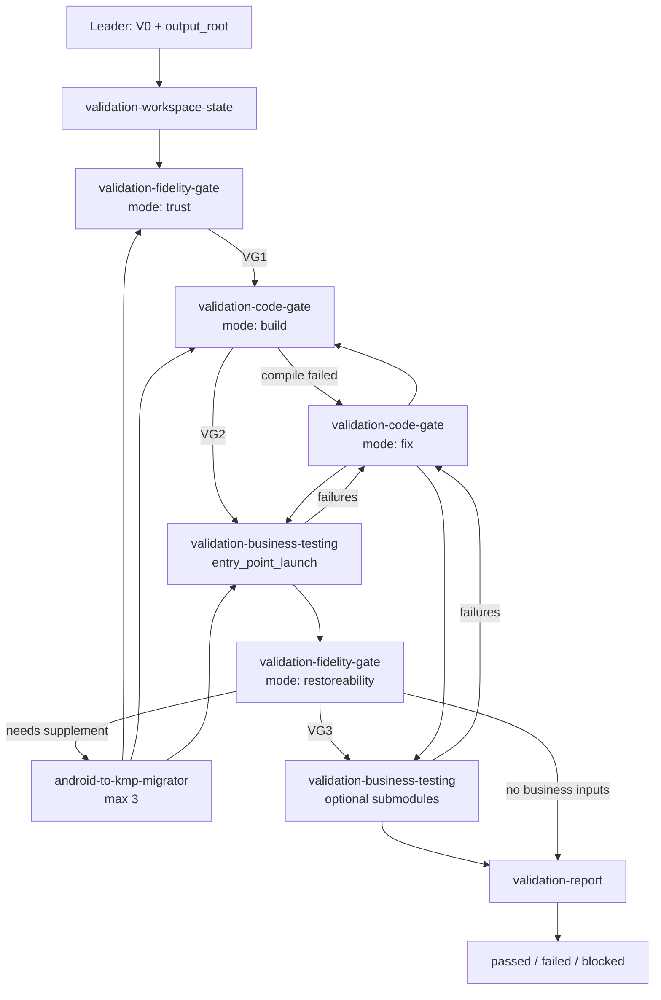

# Workflow: migrated KMP target → verified validation verdict

Serial pipeline with mode-based fidelity and code gates. See [output-contract.md](output-contract.md) and [SKILL.md](SKILL.md).

## Overview

## Steps

### Step 0 — Pre-flight

Verify migrator `V0`; write `upstream_migration_index.json`; lock `output_root` (`VG0`).

### Step 1 — Workspace State

Initialize ledger with `handoff_gates` VG0–VG5, empty **`validation_todo_list[]`**, and **`pipeline_steps[]`**; track `fix_cycles` and `migrator_supplement_cycles`. Refresh after each node group and sync todo/step status from artifacts.

### Step 2 — Fidelity Gate `trust`

- **Executor**: `validation-fidelity-gate` mode `trust`
- **Output**: `fidelity-gate/trust/validation_fidelity_trust.*`
- **Gate**: `VG1`

### Step 3 — Code Gate `build`

- **Executor**: `validation-code-gate` mode `build`
- **Compile scenarios**: `user_specified` → `global_tool_search` → `default_gradle_kmp`
- **Output**: `code-gate/build/validation_code_build.*`, `logs/code-gate/*`
- **On failure**: dispatch code-gate mode `fix` — lookup `code-gate/knowledge/compile_error_knowledge.json` and optional `error_knowledge_path` for matching bug-fix experiences, then edit target KMP files → rerun `build` (max 3 fix cycles)
- **On `VG2` pass after fix**: persist verified `knowledge_candidates` to `code-gate/knowledge/entries/<entry_id>/bug_fix_experience.*` and update the knowledge index
- **Gate**: `VG2`

### Step 3.5 — Entry Point Launch Verification (mandatory)

- **Executor**: `validation-business-testing` submodule `entry_point_launch`
- **Prerequisite**: `VG2`
- **Anchors**: Legacy Android manifest `MAIN`/`LAUNCHER` intent, analyst per-module `presentation_resource` `entry_points[]`, migrator `post_integration_alignment.json` → `entry_point_alignment_results[]`, `global_system_integration.json` → `entry_point_wiring[]`, TPA `entry_point_anchors[]`
- **Action**: Install/launch KMP Android shell; verify launcher Activity / root composable, `Application`/startup hooks, NavHost start destination, and deep-link entry handlers match the Legacy Android entry flow order and first-screen routing
- **Output**: `business-testing/entry-point-launch/validation_entry_point_launch.*`, logs under `logs/entry-point-launch/`; summary folded into `validation_business_testing.json` → `submodules.entry_point_launch`
- **On failure**: dispatch code-gate mode `fix` → rerun `build` → rerun entry point launch (counts toward fix cycles)
- **Gate**: `entry_point_launch` MUST `passed` for migration `V0` handoff; `blocked` only when launch environment unavailable and static post-build entry evidence cannot be verified

### Step 4 — Fidelity Gate `restoreability`

- **Executor**: `validation-fidelity-gate` mode `restoreability`
- **Prerequisite**: `VG2`
- **Output**: `fidelity-gate/restoreability/validation_restoreability_audit.*` (incl. `analytics_reporting_results[]` when migrator requires analytics reporting)
- **On gaps**: migrator supplement loop (max 3) → refresh upstream → rerun trust/build as scoped
- **Gate**: `VG3`

### Step 5 — Business Testing (optional)

- **Executor**: `validation-business-testing`
- **Prerequisite**: `VG3`; `entry_point_launch` already completed in Step 3.5
- **Submodules**: `entry_point_launch` (mandatory at Step 3.5), `behavioral` (user test cases), `ui_comparison` (Figma refs), `analytics_reporting` (migrator `analytics_reporting_required` — verify 埋点 reporting on key flows)
- **Output**: `business-testing/validation_business_testing.*`
- **Gate**: `VG4` or explicit skip

### Step 6 — Final Report

- **Executor**: `validation-report`
- **Gate**: `VG5`

## Controller Loops

| Loop | Max | Trigger |
|---|---|---|
| Code fix | 3 | `validation-code-gate` build failed, `entry_point_launch` failure, or other business-testing failures |
| Migrator supplement | 3 | fidelity-gate `restoreability` → `migrator_supplement_request.required` |

## Acceptance Criteria

- Dispatch only role IDs from `SKILL.md`.
- Fidelity-gate `trust` before code-gate `build`; `restoreability` after `VG2`.
- Only code-gate mode `fix` edits production code.
- Compile errors with verified solutions are stored as bug-fix experiences; same fingerprints reuse prior entries before `model_inference`.
- `entry_point_launch` runs for every migration `V0` handoff after `VG2`; optional business submodules skipped (not passed) when no user inputs.
- Final verdict evidence-backed from verified artifacts.
- `validation_todo_list` and `pipeline_steps` synced in workspace ledger before `VG5`.
