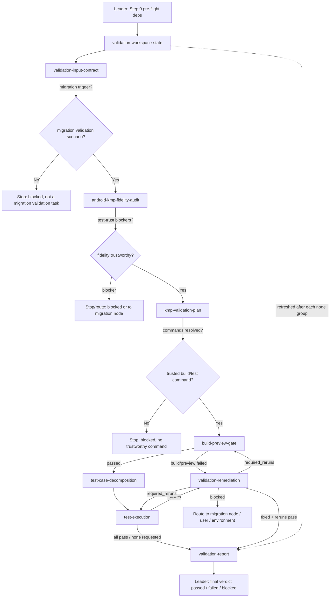

# Workflow: migrated KMP target + Android source/SPEC → verified validation verdict

This Swarm Skill is a **specialization pipeline (C) with a remediation loop**. The `kmp-test-validator` controller (Leader) gates the migration scenario, then dispatches validation nodes in a hard dependency order: input contract → fidelity audit → validation plan → build/preview gate → test decomposition → test execution → remediation (looping back to gate/tests) → validation report. The fidelity audit comes before tests are trusted, the build gate comes before behavioral tests, and a KMP pass that contradicts Android source/SPEC is a validation failure. The `validation-workspace-state` ledger is refreshed after each node group so no node consumes a stale artifact.

## Overview



The remediation loop is: `build-preview-gate` or `test-execution` failure → `validation-remediation` fixes within `allowed_files` → the node's `required_reruns` re-run the affected gate/tests → repeat until pass or `blocked` (max cycles per [bind.md](bind.md)).

## Detailed Steps

### Step 0 — Pre-flight: dependency check

- **Executor**: Leader
- **Input**: [dependencies.yaml](dependencies.yaml)
- **Action**: verify each `tools[]` entry; the target Gradle wrapper drives builds/tests.
- **Output**: pre-flight note to the user
- **Quality gate**: all deps `required: false`; the run proceeds with degraded behavior recorded. User decides go/no-go on anything missing.

### Step 1 — Initialize workspace state

- **Executor**: `validation-workspace-state`
- **Input**: target path, optional Android path, scope, known node outputs/changed files
- **Action**: initialize the validation ledger; refreshed after each later node group.
- **Output**: `validation_workspace_state.*`
- **Serial / Parallel**: serial (first, and re-run between groups)
- **Quality gate**: ledger written and non-empty; no node proceeds when its required upstream input is marked stale.

### Step 2 — Input contract gate

- **Executor**: `validation-input-contract`
- **Input**: target path, Android source/SPEC, migration report/completion evidence, changed files, validation requirements
- **Action**: verify this is a post-migration validation scenario; normalize paths; confirm KMP evidence; produce the validation brief.
- **Output**: `validation_input_contract.json` + `validation_brief.md`
- **Serial / Parallel**: serial
- **Quality gate**: `trigger_verified: true` with KMP + migration evidence → proceed; missing migration evidence → `blocked` (never downgrade to generic testing).

### Step 3 — Fidelity audit (before tests are trusted)

- **Executor**: `android-kmp-fidelity-audit`
- **Input**: validation brief, SPEC, migration report, changed files
- **Action**: compare Android source/SPEC vs migrated KMP across UI, logic, data flow, control flow; classify gaps; flag test-trust blockers.
- **Output**: `android_kmp_fidelity_audit.*`
- **Serial / Parallel**: serial
- **Quality gate**: blocker-severity gaps route to the migration node/user before tests are trusted; `needs_rerun`/`blocked` halts the trusted-test path.

### Step 4 — Validation plan

- **Executor**: `kmp-validation-plan`
- **Input**: validation brief, fidelity audit, migration report, optional user commands
- **Action**: discover structure/source sets/frameworks; resolve build/preview/test commands (user → project scripts/CI → verified Gradle tasks); map scope to targets.
- **Output**: `kmp_validation_plan.*`
- **Serial / Parallel**: serial
- **Quality gate**: at least one trustworthy build/test command resolved with `command_sources`; else `blocked` (no invented command).

### Step 5 — Build/preview gate (before behavioral tests)

- **Executor**: `build-preview-gate`
- **Input**: validation brief, validation plan, fidelity audit, changed files
- **Action**: run the resolved build command; when UI is in scope, the resolved Compose preview/renderability gate; capture logs.
- **Output**: `build_preview_gate.*` + log files
- **Serial / Parallel**: serial — gates the test stage
- **Quality gate**: `passed` → Step 6; `failed` → route fixable target-code failures to `validation-remediation` (Step 8) and do NOT run behavioral tests; `blocked` → surface with evidence.

### Step 6 — Test case decomposition

- **Executor**: `test-case-decomposition`
- **Input**: validation brief, fidelity audit, validation plan, build/preview gate, migration report, validation requirements
- **Action**: decompose user tests / SPEC acceptance / migration validation inputs into atomic, Android-anchored cases.
- **Output**: `test_case_inventory.*`
- **Serial / Parallel**: serial (runs when test cases/use cases/acceptance criteria exist)
- **Quality gate**: each case atomic with Android evidence + execution channel; Android-vs-SPEC conflict → `blocked` (no fabricated expectations).

### Step 7 — Test execution

- **Executor**: `test-execution`
- **Input**: validation brief, fidelity audit, validation plan, build/preview gate (passed), test inventory
- **Action**: run each atomic case via the project's convention; capture evidence; a KMP pass that contradicts Android evidence is a failure.
- **Output**: `test_execution_results.*` + logs + any created test files
- **Serial / Parallel**: serial — only after the build gate passes
- **Quality gate**: `passed` → Step 9; `failed` → route to `validation-remediation` (Step 8).

### Step 8 — Remediation loop (on confirmed failures)

- **Executor**: `validation-remediation`, then re-run the affected gate/tests
- **Input**: failing build/preview gate or test results, `allowed_files`, failure IDs, fidelity audit, validation plan
- **Action**: confirm each failure is a target KMP issue, apply the narrowest Android/SPEC-anchored fix in `allowed_files`, and emit `required_reruns`.
- **Output**: `validation_remediation.*` + changed files
- **Serial / Parallel**: serial loop with Steps 5/7
- **Quality gate**: every fix is followed by its `required_reruns`; loop until gate+tests pass or `blocked` (max cycles per [bind.md](bind.md)); non-target failures route to migration node/user/environment.

### Step 9 — Final: validation report

- **Executor**: `validation-report`, then Leader
- **Input**: workspace state, fidelity, plan, build/preview, test inventory/results, remediation, migration report
- **Action**: synthesize the final status; Leader returns the verdict.
- **Output**: `kmp_validation_report.*` + the completion summary below
- **Quality gate**: report runs only when the latest workspace state shows no stale required inputs.

#### Final Report Format

```json
{
  "status": "passed | failed | blocked",
  "migration_scope": "...",
  "kmp_target_project_path": "...",
  "fidelity_summary": { "ui": "", "logic": "", "data_flow": "", "control_flow": "" },
  "build_summary": {},
  "preview_or_renderability_summary": {},
  "test_statistics": { "total": 0, "passed": 0, "failed": 0, "skipped": 0, "blocked": 0 },
  "remediation_summary": [],
  "remaining_failures": [],
  "blocking_gaps": [],
  "report_path": "..."
}
```

## Acceptance Criteria

- Every dispatched node returned output matching its role `## Output Schema` and the shared return shape; any `[ROLE MISSING]` is recorded per [bind.md](bind.md).
- **Gate check (C-pattern)**: the input contract verified the migration scenario before any audit; the fidelity audit ran before tests were trusted; the build/preview gate passed before behavioral tests ran.
- **Loop check**: every remediation fix was followed by its `required_reruns`; no fix counts as resolved without a passing rerun.
- A KMP pass that contradicts Android source/SPEC is recorded as a failure, not a pass.
- Build/test commands came from user input, project scripts, target understanding, or verified Gradle discovery — none invented.
- `validation-report` runs only when no required input is stale and decides `passed | failed | blocked`; if `blocked`, the final response lists blockers and exact missing evidence.
