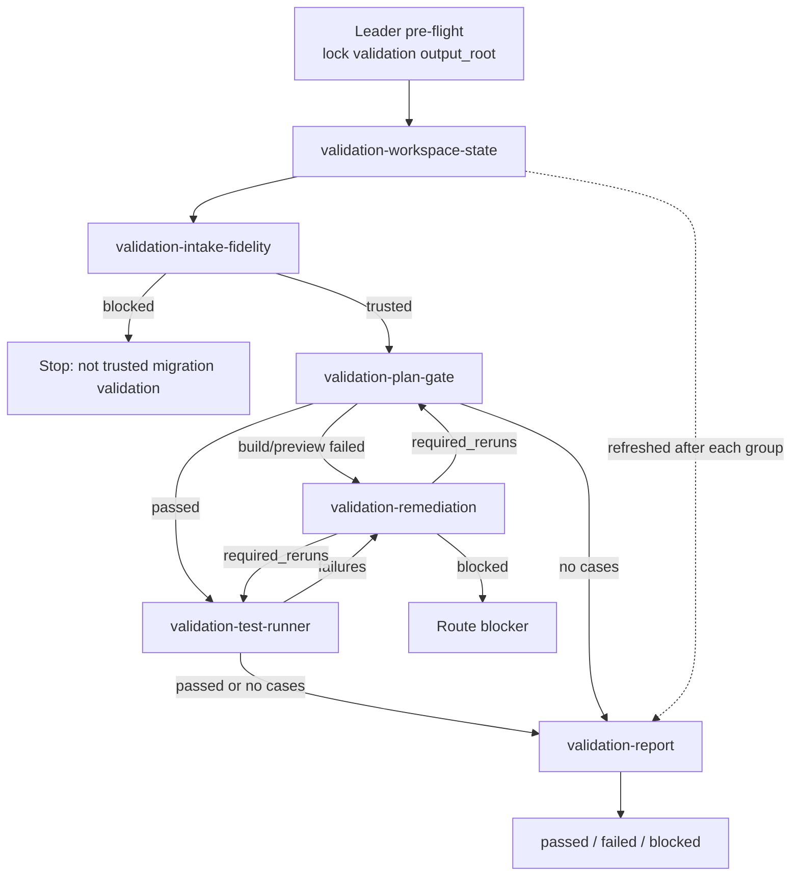

# Workflow: migrated KMP target + Android source/SPEC -> verified validation verdict

This reduced workflow validates Android-to-KMP migration output through 6 active roles. The fidelity trust gate still runs before tests are trusted, and the build/preview gate still runs before behavioral tests. Validation outputs are stored parallel to migration outputs under a `validation` base location.

## Overview



## Strict Output Roots

Validation output is parallel to migration output:

```text
validation_base = <output_dir or ~/.a2c_agents/validation>
output_root = <validation_base>/kmp-test-validator
workspace_state_dir = <output_root>/workspace-state
intake_dir = <output_root>/intake-fidelity
plan_gate_dir = <output_root>/plan-gate
test_runner_dir = <output_root>/test-runner
remediation_dir = <output_root>/remediation
report_dir = <output_root>/report
logs_dir = <output_root>/logs
```

When `migration_output_root` is known, it is a read-only input. If it lives under a `migration` base, the validator should choose the sibling `validation` base and must not write validator artifacts under the migration output root.

## Detailed Steps

### Step 0 — Pre-flight

- **Executor**: Leader
- **Input**: [dependencies.yaml](dependencies.yaml)
- **Action**: verify optional tools; target Gradle wrapper drives build/test. Lock `output_root = <output_dir or ~/.a2c_agents/validation>/kmp-test-validator` and write `run_manifest.json`.
- **Output**: `<output_root>/run_manifest.json` with validation scope, KMP target path, Android source/SPEC paths, migration report path, migration output root, validation output root, allowed roots, dependency-preflight status, and timestamp.
- **Gate**: missing optional tools are recorded as degraded behavior.

### Step 1 — Workspace State

- **Executor**: `validation-workspace-state`
- **Action**: initialize ledger and refresh after each major group.
- **Output**: `<workspace_state_dir>/validation_workspace_state.json`, `.md`. Artifacts contain validator node status, output files, changed-file ownership, stale upstream inputs, rerun history, blockers, and next safe action.
- **Gate**: no role consumes stale required inputs.

### Step 2 — Intake And Fidelity Trust Gate

- **Executor**: `validation-intake-fidelity`
- **Action**:
  - verify post-migration validation trigger.
  - normalize validation brief.
  - verify KMP evidence and migration evidence.
  - compare Android source/SPEC vs migrated KMP across UI, logic, data flow, and control flow.
  - flag `test_trust_blockers`.
- **Output**: `<intake_dir>/validation_intake_fidelity.json`, `.md`. Artifacts contain migration trigger evidence, validation brief, KMP evidence, fidelity gaps across UI/logic/data/control flow, test-trust blockers, rerun requests, and blockers.
- **Gate**: missing migration evidence or blocking fidelity gaps stop trusted tests and route to user/migration/remediation.

### Step 3 — Validation Plan And Build/Preview Gate

- **Executor**: `validation-plan-gate`
- **Action**:
  - discover target modules/source sets/test frameworks.
  - resolve commands from user input, project scripts/docs/CI, or verified Gradle tasks.
  - run resolved build command.
  - run preview/renderability gate when UI is in scope.
  - classify failures and route by owner.
- **Output**: `<plan_gate_dir>/validation_plan_gate.json`, `.md`, plus `<logs_dir>/plan-gate/*` when commands run. Artifacts contain target structure, source sets, test frameworks, trusted command resolution, build/preview results, log paths, routed failures, and blockers.
- **Gate**: behavioral tests do not run unless required build/preview gates pass.

### Step 4 — Test Runner

- **Executor**: `validation-test-runner`
- **Action**:
  - decompose validation requirements and migration report inputs into atomic Android-anchored cases.
  - reuse existing tests when possible.
  - create minimal project-convention tests only when needed.
  - execute through trusted commands/channels.
  - record pass/fail/skip/blocker evidence.
- **Output**: `<test_runner_dir>/validation_test_runner.json`, `.md`, plus `<logs_dir>/test-runner/*` and changed test files when created. Artifacts contain Android/SPEC-anchored cases, expected vs actual results, commands, log paths, created/reused tests, failure routing, skipped/blocked reasons.
- **Gate**: a KMP pass that contradicts Android evidence is a failure.

### Step 5 — Remediation Loop

- **Executor**: `validation-remediation`
- **Input**: failed plan/build gate or test runner outputs, `allowed_files`, failure IDs, fidelity evidence
- **Action**: fix only confirmed target KMP failures inside allowed files.
- **Output**: `<remediation_dir>/<cycle_id>/validation_remediation.json`, `.md`. Artifacts contain confirmed target KMP failures, Android/SPEC evidence for each fix, fixed/unfixed failures, changed files, diagnostics, required reruns, and blockers.
- **Gate**: every remediation emits `required_reruns`; the controller reruns `validation-plan-gate` and/or `validation-test-runner` until pass or blocked.

### Step 6 — Final Report

- **Executor**: `validation-report`
- **Input**: workspace state, intake/fidelity, plan/gate, test runner, remediation, migration report
- **Action**: synthesize the final validation verdict.
- **Output**: `<report_dir>/kmp_validation_report.json`, `.md`. Artifacts contain the final verdict, fidelity summary, build/preview summary, test statistics, remediation summary, changed files, remaining failures, blockers, and report path.
- **Gate**: report runs only when latest workspace state shows no stale required inputs.

## Final Report Format

```json
{
  "status": "passed | failed | blocked",
  "migration_scope": "",
  "kmp_target_project_path": "",
  "fidelity_summary": { "ui": "", "logic": "", "data_flow": "", "control_flow": "" },
  "build_summary": {},
  "preview_or_renderability_summary": {},
  "test_statistics": { "total": 0, "passed": 0, "failed": 0, "skipped": 0, "blocked": 0 },
  "remediation_summary": [],
  "remaining_failures": [],
  "blocking_gaps": [],
  "report_path": ""
}
```

## Acceptance Criteria

- Active dispatch uses only the 6 reduced role IDs.
- All validator outputs are under `<validation_base>/kmp-test-validator`, parallel to the migration output location, and migration artifacts are consumed read-only by path.
- Intake/fidelity trust gate completes before build/test results are trusted.
- Build/preview gate passes before behavioral tests run.
- Commands are trusted and never invented.
- Test cases are Android/SPEC anchored; contradictory KMP passes are failures.
- Every remediation fix is followed by required reruns.
- `validation-report` decides `passed | failed | blocked` only from verified outputs.
