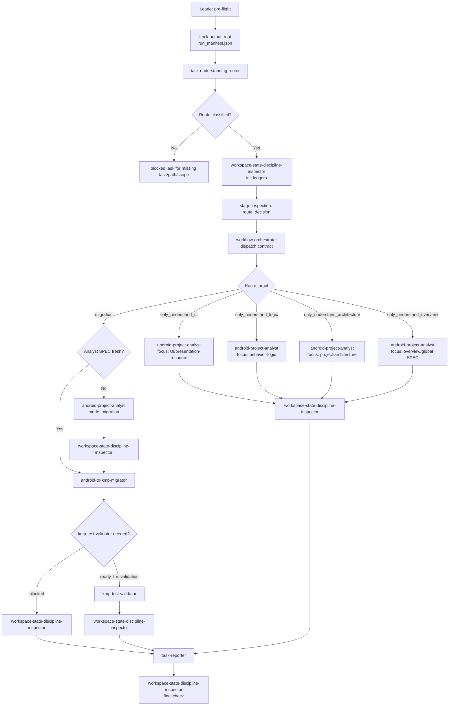

# Workflow: input task -> route decision -> downstream workflow -> inspected task report

This adapter is a small orchestration swarm in front of the Android analyst, KMP migrator, and KMP validator. Its output is not the migration itself; its output is a verified task route, a downstream workflow record, stage inspection records, intermediate asset records, and a final task report.

## Overview



## Strict Output Paths

The Leader must lock one adapter `output_root` before dispatch:

```text
output_root = <output_dir or ~/.a2c_agents/task-adapter>/migration-task-adapter
task_dir = <output_root>/task
workspace_state_dir = <output_root>/workspace-state
orchestration_dir = <output_root>/orchestration
stage_inspection_dir = <output_root>/stage-inspections
intermediate_asset_dir = <output_root>/intermediate-assets
report_dir = <output_root>/report
```

Required durable artifacts:

| Schedule point | Required artifacts |
|---|---|
| Output root lock | `<output_root>/run_manifest.json` |
| Task understanding | `<task_dir>/task_understanding_router.json`, `<task_dir>/task_understanding_router.md` |
| Workspace discipline | `<workspace_state_dir>/workspace_state_discipline.json`, `<workspace_state_dir>/workspace_state_discipline.md` |
| Stage inspection | `<stage_inspection_dir>/<stage_id>/stage_inspection.json`, `<stage_inspection_dir>/<stage_id>/stage_inspection.md` |
| Intermediate assets | `<intermediate_asset_dir>/intermediate_asset_records.json`, `<intermediate_asset_dir>/intermediate_asset_records.md` |
| Orchestration | `<orchestration_dir>/workflow_orchestration.json`, `<orchestration_dir>/workflow_orchestration.md` |
| Final report | `<report_dir>/task_adapter_report.json`, `<report_dir>/task_adapter_report.md` |

No adapter role may write inside downstream workflow output roots except by invoking the downstream controller with its own declared `output_dir`. Downstream artifacts are referenced by path in intermediate asset records.

## Route Matrix

| Route | Required inputs | Downstream workflow | Required downstream evidence |
|---|---|---|---|
| `only_understand_ui` | Android source path, UI/screen/feature scope when available | `android-project-analyst` in exploration mode with `analysis_focus: ui` | `presentation_resource.*`, module/global representation, `SPEC/design.md`, `SPEC/verification.md` |
| `only_understand_logic` | Android source path, logic/feature/use-case scope when available | `android-project-analyst` in exploration mode with `analysis_focus: logic` | verified Stage A outputs plus `behavior_logic.*`, module/global representation, `SPEC/verification.md` |
| `only_understand_architecture` | Android source path, module/project scope | `android-project-analyst` in exploration mode with `analysis_focus: architecture` | `project_architecture.*`, module/global representation, `SPEC/design.md`, `SPEC/verification.md` |
| `only_understand_overview` | Android source path, overview/full or feature scope | `android-project-analyst` in exploration mode | module inventory, all node outputs in scope, module/global representation, SPEC |
| `migration` | Android source or fresh analyst SPEC, KMP target path, migration scope | `android-project-analyst` if needed, then `android-to-kmp-migrator`, then optional `kmp-test-validator` | analyst SPEC, migration module inventory, module/global migration representation, `migration_report.*`, validation report when run |
| `validation_handoff` | KMP target path, Android source/SPEC, migration report | `kmp-test-validator` | validation intake, plan/build gate, test runner/remediation as applicable, validation report |

## Detailed Steps

### Step 0 - Pre-flight

- **Executor**: Leader.
- **Input**: [dependencies.yaml](dependencies.yaml), user task, optional source/target/output paths.
- **Action**: verify optional tools and lock `output_root`. Write `run_manifest.json` with task id, timestamp, requested scope, allowed roots, downstream workflow candidates, and schedule version.
- **Gate**: `run_manifest.json` exists and is non-empty before any role runs.

### Step 1 - Task Understanding And Router

- **Executor**: `task-understanding-router`.
- **Input**: raw user task, paths, current workspace hints, optional existing analyst/migrator/validator artifact paths.
- **Action**: normalize request, classify route, select focus, identify missing evidence, create downstream route contract.
- **Output**: `task_understanding_router.json`, `task_understanding_router.md`.
- **Gate**: route must be one of the route matrix values or `blocked` with missing inputs. No downstream workflow starts on `unknown`.

### Step 2 - Workspace State Discipline Init

- **Executor**: `workspace-state-discipline-inspector`.
- **Action**: initialize or refresh workspace discipline ledger, stage inspection index, intermediate asset records, rerun/blocker history.
- **Output**: `workspace_state_discipline.*`, first `stage_inspection.*`, and `intermediate_asset_records.*`.
- **Gate**: task understanding artifacts and run manifest are recorded as intermediate assets before orchestration.

### Step 3 - Workflow Orchestration

- **Executor**: `workflow-orchestrator`.
- **Action**:
  - Build exact downstream dispatch contracts from the route decision.
  - Record downstream output roots and expected artifacts.
  - After downstream workflow completion, record observed outputs, statuses, blockers, and required reruns.
  - Route stale or missing downstream outputs back to the owning workflow.
- **Output**: `workflow_orchestration.json`, `workflow_orchestration.md`.
- **Gate**: orchestration cannot claim `completed` until downstream workflow status and required artifact paths are recorded or blockers are explicit.

### Step 4 - Stage Inspections

- **Executor**: `workspace-state-discipline-inspector`.
- **Required inspection points**:
  - `route_decision`
  - `pre_downstream_dispatch`
  - `post_analyst`
  - `post_migrator`
  - `post_validator`
  - `pre_report`
  - `post_report`
- **Action**: for each applicable point, verify current stage inputs, outputs, freshness, path compliance, intermediate asset coverage, and rerun/blocker routing.
- **Output**: one `stage_inspection.json` and `.md` per stage id plus refreshed workspace discipline and asset ledgers.
- **Gate**: final report cannot run unless `pre_report` stage inspection passes or explicitly reports `blocked`.

### Step 5 - Intermediate Asset Records

- **Executor**: `workspace-state-discipline-inspector` with updates from `workflow-orchestrator`.
- **Action**: record every durable artifact consumed across stages.
- **Required fields**:
  - `asset_id`
  - `asset_type`
  - `producer`
  - `path`
  - `status`
  - `created_or_observed_at`
  - `freshness_basis`
  - `consumers`
  - `source_evidence`
  - `blocking_gaps`
- **Gate**: every `output_files[]` item returned by an adapter role or downstream workflow must appear in `intermediate_asset_records.*` before a downstream consumer uses it.

### Step 6 - Task Report

- **Executor**: `task-reporter`.
- **Input**: run manifest, task understanding, workflow orchestration, latest workspace discipline, stage inspections, intermediate asset records, downstream reports.
- **Action**: synthesize a final machine-routable task report. Do not run new analysis, migration, validation, tests, or fixes.
- **Output**: `task_adapter_report.json`, `task_adapter_report.md`.
- **Gate**: report status is `completed`, `ready_for_validation`, `failed`, or `blocked` only from verified evidence.

## Final Report Shape

```json
{
  "status": "completed | ready_for_validation | failed | blocked",
  "task_id": "",
  "route": "",
  "understand_focus": "ui | logic | architecture | overview | mixed | none",
  "source_project_path": "",
  "target_project_path": "",
  "output_root": "",
  "downstream_workflows": [],
  "stage_inspection_summary": [],
  "intermediate_asset_summary": [],
  "downstream_outputs": [],
  "readiness": "ready | ready_with_assumptions | ready_for_validation | blocked",
  "rerun_requests": [],
  "blocking_gaps": [],
  "report_path": ""
}
```

## Acceptance Criteria

- Task route is classified before any downstream workflow is invoked.
- Only-understand UI/logic/architecture/overview routes go through `android-project-analyst`; migration routes go through analyst completion before migrator when SPEC is missing or stale.
- Stage inspection records exist for every applicable route boundary and downstream workflow boundary.
- Intermediate asset records include every durable adapter and downstream artifact consumed by a later stage.
- Latest workspace discipline inspection has no stale required inputs before `task-reporter` runs.
- Final task report cites paths to verified downstream artifacts and lists unresolved gaps instead of filling them in.
